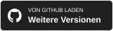

<h1 align="center">Shotera</h1>

<strong>Präzise erfassen. Klar erklären. Im Arbeitsfluss bleiben.</strong>

Eine Windows-App für Screenshots, Anmerkungen und angeheftete Desktop-Inhalte mit KI-Bildwerkzeugen, Offline-OCR, intelligenter Auswahl, Bildübersetzung und Präsentationsmodus.

<a href="README.md">English</a> · <a href="README.zh-CN.md">简体中文</a> · <a href="README.zh-TW.md">繁體中文</a> · <a href="README.ja.md">日本語</a> · <a href="README.pt-BR.md">Português (Brasil)</a> · <a href="README.es.md">Español</a> · <strong><a href="README.de.md">Deutsch</a></strong> · <a href="README.fr.md">Français</a> · <a href="README.it.md">Italiano</a> · <a href="README.ko.md">한국어</a> · <a href="README.ru.md">Русский</a> · <a href="README.ar.md">العربية</a> · <a href="README.nl.md">Nederlands</a> · <a href="README.pl.md">Polski</a> · <a href="README.sv.md">Svenska</a>

  

 

<h3 align="center">Shotera herunterladen</h3>

 

<strong>🧭 Schnellnavigation</strong>

[Warum Shotera](#für-die-arbeit-nach-dem-screenshot) · [Kernfunktionen](#kernfunktionen) · [Produktgalerie](#produktgalerie) · [Alle Funktionen](#vollständiger-funktionsumfang) · [Datenschutz](#datenschutz-und-kontrolle) · [Download](#download-und-editionen) · [Support](#support-und-feedback)

<figure>
<strong>Shotera auf einen Blick.</strong> Intelligente Aufnahme, KI-Werkzeuge, Anmerkungen, Offline-OCR und Bildübersetzung in einer Windows-App.
</figure>

 

## Für die Arbeit nach dem Screenshot

Shotera macht aus einem Screenshot ein Ergebnis, das sich erklären, teilen oder wiederverwenden lässt. Produktfeedback, Fehlerberichte, Anleitungen, Dokumentation, Support, Design-Reviews und Besprechungen bleiben in einem konzentrierten Ablauf.

 

## Kernfunktionen

- **Intelligente, präzise Aufnahme:** Fenster und verschachtelte UI-Elemente erkennen und die Auswahl pixelgenau verfeinern.
- **KI-Bildbearbeitung:** Motive mit KI-Freistellung isolieren und unerwünschte Inhalte mit KI-Radierer entfernen.
- **Offline-OCR und Bildübersetzung:** Kopierbaren Text auf dem Gerät extrahieren und Bildtext schnell übersetzen, ohne Screenshots zur Texterkennung hochzuladen.
- **Anmerkungen und Datenschutz:** Pfeile, Text, Schritte, Vergrößerung, Mosaik und Gauß-Weichzeichnung für klare und sichere Erklärungen.
- **Desktop-Pins und Präsentationsmodus:** Mit `F3` Referenzen sichtbar halten, mit `Pause` Desktop-Ablenkungen ausblenden.

 

## Produktgalerie

<figure>
<strong>Intelligente Aufnahme.</strong> Mit <code>F1</code> starten, Fenster oder UI-Element auswählen und direkt kommentieren.
</figure> 
<figure>
<strong>Anmerken und schützen.</strong> Schritte erklären und sensible Inhalte verbergen.
</figure> 
<figure>
<strong>Offline-OCR und Übersetzung.</strong> Text im Aufnahmeablauf extrahieren und übersetzen.
</figure> 
<figure>
<strong>KI-Freistellung.</strong> Motiv und Hintergrund trennen und transparente Assets erstellen.
</figure> 
<figure>
<strong>Emoji-Sticker.</strong> Skalierbare visuelle Akzente setzen.
</figure> 
<figure>
<strong>Präsentationsmodus.</strong> Mit <code>Pause</code> Ablenkungen ausblenden und später wiederherstellen.
</figure> 
<figure>
<strong>Komplettes visuelles Werkzeugset.</strong> Screenshot, Anmerkung, OCR, Übersetzung, GIF und Emoji in einer App.
</figure>

 

## Vollständiger Funktionsumfang

1. **Aufnahme:** Mit `F1` Bereiche, Fenster, UI-Elemente oder den ganzen Bildschirm erfassen, einschließlich Maße, Seitenverhältnis, Koordinaten, Verzögerung und Vorlagen.
2. **KI-Bildbearbeitung:** Transparente Assets freistellen und unerwünschte Bildinhalte entfernen.
3. **OCR und Übersetzung:** Text lokal aus Screenshots, Bildern und Dokumenten extrahieren oder Text in Bildern übersetzen.
4. **Anmerkung und Schutz:** Formen, Pfeile, Text, Zeichnung, Hervorhebung, Schritte, Emoji und Lupe hinzufügen; Inhalte mit Mosaik oder Weichzeichnung verbergen.
5. **Desktop-Pins:** Mit `F3` Screenshots und kompatible Zwischenablage-Inhalte anheften sowie Deckkraft, Drehung, Spiegelung, Durchklicken und Sichtbarkeit anpassen.
6. **Präsentationsmodus:** Mit `Pause` Desktop-Symbole ausblenden und den vorherigen Zustand wiederherstellen.
7. **Bearbeitung und Ausgabe:** Verschieben, skalieren, drehen, rückgängig machen und wiederholen; schnell oder automatisch in mehreren Formaten speichern.
8. **Personalisierung:** Tastenkürzel, Sprache, Schriften, Startverhalten und Tray-Symbole anpassen.

 

## Ein fokussierter Windows-Ablauf

`F1` drücken, Ziel auswählen, Grenzen verfeinern, anmerken oder bearbeiten und anschließend speichern, teilen oder mit `F3` sichtbar anheften.

 

## Datenschutz und Kontrolle

Shotera speichert Aufnahmen lokal. Offline-OCR läuft direkt auf dem Gerät, daher müssen Screenshots zur Texterkennung nicht hochgeladen werden. Tastenkürzel, Sprache, Schriften, Startverhalten und Tray-Symbole bleiben anpassbar. Mehr in der [Datenschutzerklärung](https://shotera.mosuzo.com/privacy).

 

## Unterstützte Sprachen

Shotera ist in **15 Oberflächensprachen** verfügbar:

<kbd>English</kbd> <kbd>简体中文</kbd> <kbd>繁體中文</kbd> <kbd>日本語</kbd> <kbd>Português (Brasil)</kbd> <kbd>Español</kbd> <kbd>Deutsch</kbd> <kbd>Français</kbd> <kbd>Italiano</kbd> <kbd>한국어</kbd> <kbd>Русский</kbd> <kbd>العربية</kbd> <kbd>Nederlands</kbd> <kbd>Polski</kbd> <kbd>Svenska</kbd>

 

## Schlüsselwörter

Shotera; Shotera AI; Mosuzo Studio; KI-Freistellung; KI-Bildreparatur; Offline-OCR; Bildschirmaufnahme; Screenshot-Editor; Bildanmerkung; Desktop-Pin; Bildübersetzung

 

## Download und Editionen

 

> **Editionshinweis:** Die Funktionen der Basisversion bleiben dauerhaft kostenlos. Einige erweiterte Funktionen erfordern Pro und können je nach Version variieren.

 

## Support und Feedback

Fragen, Vorschläge und Rückmeldungen sind jederzeit willkommen.

   

 

## Shotera auf Ko-fi unterstützen

Wenn Shotera Ihre Arbeit erleichtert, hilft Ihre Unterstützung bei der Weiterentwicklung und neuen Funktionen. Aktuelle Entwicklungsneuigkeiten teilen wir ebenfalls auf Ko-fi.

---

 <strong>Mosuzo Studio</strong> · Copyright © 2026. Alle Rechte vorbehalten. Shotera wurde für Windows entwickelt, um Screenshots, visuelle Kommunikation und Desktop-Referenzen effizienter zu machen.

