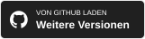

  

<h1 align="center">Shotera</h1>

  <strong>Präzise erfassen. Klar erklären. Im Arbeitsfluss bleiben.</strong> 
  Screenshot · Langer Screenshot · Auf Desktop anheften · Bildschirmaufnahme & GIF · Offline-OCR & Bildübersetzung · AI-Freistellen & AI-Radierer

  Eine Windows-App zum Aufnehmen: schnell erfassen, schnell annotieren, immer griffbereit; 
  sofort kopieren oder direkt annotieren.

  
  
  

  
  
  
  

  <a href="README.md">English</a> ·
  <a href="README.zh-CN.md">简体中文</a> ·
  <a href="README.zh-TW.md">繁體中文</a> ·
  <a href="README.ja.md">日本語</a> ·
  <a href="README.pt-BR.md">Português (Brasil)</a> ·
  <a href="README.es.md">Español</a> ·
  <strong><a href="README.de.md">Deutsch</a></strong> ·
  <a href="README.fr.md">Français</a> ·
  <a href="README.it.md">Italiano</a> ·
  <a href="README.ko.md">한국어</a> ·
  <a href="README.ru.md">Русский</a> ·
  <a href="README.ar.md">العربية</a> ·
  <a href="README.nl.md">Nederlands</a> ·
  <a href="README.pl.md">Polski</a> ·
  <a href="README.sv.md">Svenska</a>

 

  <strong>Shotera herunterladen</strong> · Windows 10 / 11 (64-Bit)

  
  

<strong>🧭 Schnellnavigation</strong>

| Was es kann | Mehr erfahren | Erste Schritte |
| --- | --- | --- |
| [Kernfunktionen](#kernfunktionen): Screenshot · Langer Screenshot · Auf Desktop anheften · Bildschirmaufnahme & GIF · Offline-OCR & Bildübersetzung · AI-Freistellen & AI-Radierer [Weitere Funktionen](#weitere-funktionen): Anmerkungen & Unkenntlichmachung · Emoji-Sticker · Präsentationsmodus · Dunkler Modus · Multi-Monitor | [Für die Arbeit nach dem Screenshot](#für-die-arbeit-nach-dem-screenshot) [FAQ](#faq) [Windows-Ablauf](#ein-fokussierter-windows-ablauf) [Datenschutz und Kontrolle](#datenschutz-und-kontrolle) [Unterstützte Sprachen](#unterstützte-sprachen) | [Download und Editionen](#download-und-editionen) [Support und Feedback](#support-und-feedback) [Shotera auf Ko-fi unterstützen](#shotera-auf-ko-fi-unterstützen) |

> **Drei Schritte zum Start:** ① installieren → ② `F1` drücken und den Bereich auswählen → ③ annotieren und kopieren oder mit `F3` auf dem Desktop anheften.

<figure>
  
  
<strong>Shotera auf einen Blick.</strong> Von Screenshots und langen Seiten über Anheften und Bildschirmaufnahme bis Texterfassung und AI-Aufbereitung — alles in einem Fenster.

</figure>

 

## Für die Arbeit nach dem Screenshot

Das Schwierige ist selten die Aufnahme — es ist das, was danach kommt: annotieren, unkenntlich machen, eine lange Seite zusammenfügen, Text extrahieren, eine Referenz im Blick behalten. Shotera fasst diese Arbeit in einem einzigen Ablauf zusammen — die Aufnahme ist bereit, sobald Sie sie gemacht haben.

- **Kein zweiter Durchgang:** annotieren, unkenntlich machen und vergrößern in derselben Leiste
- **Alles Lange in einem Bild:** lange Seiten, Chats und Dokumente, automatisch zusammengefügt
- **Referenzen bleiben im Blick:** mit `F3` heften Sie die Aufnahme oben an, während Sie arbeiten

Typische Anwendungsfälle: Produktfeedback, Fehlerberichte, Tutorials und Dokumentation, Support-Antworten, Design-Reviews, Demos.

 

## Kernfunktionen

### 📸 Screenshot · Aufnehmen mit einem Tastendruck, exakt im Rahmen

Drücken Sie `F1`: Beim Überfahren dockt Shotera automatisch an das Fenster oder Element unter dem Zeiger an; die Kanten justieren Sie mit der Lupe fein nach.

- Pfeile, Nummerierung, Text und Mosaik — sofort angewendet
- Feste Größe, Seitenverhältnis, Koordinaten und Verzögerung für wiederholbare Aufnahmen

**Im Detail:** Andocken an Fenster- und UI-Elementkanten, pixelgenaues Feinjustieren, gespeicherte Vorlagen und verzögerte Aufnahmen.

<figure>
  
  
<strong>Intelligente Aufnahme.</strong> Fenster oder UI-Element wählen und direkt in der Leiste annotieren.

</figure>

> **Zwei Fertig-Modi — jederzeit umschaltbar**
>
> **Elegant:** kopiert beim Loslassen sofort in die Zwischenablage; die Meldung unten rechts öffnet den Editor. **Direkt kommentieren:** die Leiste erscheint mit der Auswahl, sodass Sie vor dem Kopieren annotieren. Beides finden Sie unter Einstellungen → Screenshot.

<figure>
  
  
<strong>Zwei Fertig-Modi.</strong> Links: Elegant; rechts: Direkt kommentieren.

</figure>

### 📜 Langer Screenshot · Eine Seite höher als der Bildschirm, in einer Aufnahme

Lange Seiten, Chats und Dokumente — von oben bis unten in einem einzigen Bild festgehalten.

- Automatisch scrollen lassen oder selbst scrollen — jeder Frame wird erfasst
- Benachbarte Frames werden abgeglichen und überblendet — keine sichtbaren Nähte
- Live-Vorschau beim Zusammenfügen: stoppen, sobald alles erfasst ist

**Im Detail:** Gemacht für lange Webseiten, Chatverläufe und komplette Dokumente; die fertige Aufnahme landet direkt in Dokumentation und Issues.

<figure>
  
  
<strong>Langer Screenshot.</strong> Lange Seiten und Chats, zu einem Bild zusammengefügt.

</figure>

### 📌 Auf Desktop anheften · Referenzen oben anheften und daneben weiterarbeiten

Mit `F3` bleibt eine Aufnahme über allem anderen — vergleichen und nachschlagen, ohne Fenster zu wechseln.

- Skalieren, Drehen, Transparenz und Maus-Durchgriff
- Doppelklick wechselt zwischen Originalgröße und Miniaturansicht; die zuletzt geschlossene Aufnahme holen Sie mit einem Klick zurück

**Im Detail:** An jeder Kante oder Ecke ziehen, um mit fixiertem Seitenverhältnis zu skalieren; angeheftete Aufnahmen bleiben über Ihren Fenstern und blockieren keine Klicks.

<figure>
  
  
<strong>Auf Desktop anheften.</strong> Referenzen bleiben oben, während Sie weiterarbeiten.

</figure>

### 🎬 Bildschirmaufnahme & GIF · In 4K aufnehmen, so lange wie nötig

Aus „schwer zu erklären“ wird ein Video, dem jeder folgen kann.

- 720p / 1080p / 2K / 4K bei 30 oder 60 fps, ohne Zeitlimit
- Cursor- und Klick-Hervorhebungen; Export als MP4 oder leichtes GIF

**Im Detail:** GIFs bleiben klein genug für Dokumentation, Issues und Chats, und die hohen Auflösungen überzeugen auch auf HiDPI-Displays.

<figure>
  
  
<strong>Bildschirmaufnahme & GIF.</strong> Einmal zeigen statt zweimal erklären.

</figure>

### 🔍 Offline-OCR & Bildübersetzung · Pixel zurück in Text verwandeln

- **Offline-OCR:** mehrere Sprachen; Text in einem Zug kopieren und einfügen
- **Bildübersetzung:** fremdsprachige Screenshots in Ihrer Sprache lesen
- **QR- und Barcode-Erkennung:** Links, Wi-Fi, Kontakte und Produktcodes

**Im Detail:** Die Erkennung läuft auf Ihrem Gerät; die Ergebnisse sind nur einen Klick von der Zwischenablage entfernt.

<figure>
  
  
<strong>Offline-OCR & Bildübersetzung.</strong> Erfassen und übersetzen, ohne den Aufnahmeablauf zu verlassen.

</figure>

### ✨ AI-Freistellen & AI-Radierer · AI, die den Screenshot für Sie fertigstellt

- **AI-Freistellen:** Personen, Produkte, Logos — ein transparentes PNG in Sekunden
- **AI-Radierer:** Störendes und Wasserzeichen entfernen — die AI rekonstruiert, was dahinter lag

**Im Detail:** Beide laufen auf lokalen Modellen — das Originalbild wird nie hochgeladen. Freistellungen lassen sich kopieren oder als transparentes PNG speichern.

<figure>
  
  
<strong>AI-Freistellen.</strong> Motiv und Hintergrund, in einem Schritt getrennt.

</figure>

 

## Weitere Funktionen

### 🖊️ Anmerkungen & Unkenntlichmachung

Pfeile, Text, Pinsel, Textmarker, Nummerierung, Lupe; Mosaik und Gauß-Weichzeichnung für alles, was privat bleiben soll.

**Im Detail:** Anmerkungen lassen sich verschieben, skalieren und drehen — mit Rückgängig und Wiederholen, wenn Sie es sich anders überlegen.

<figure>
  
  
<strong>Anmerkungen & Unkenntlichmachung.</strong> Schritte klar erklären, Sensibles privat halten.

</figure>

### 😀 Emoji-Sticker

Hunderte Emoji-Sticker, frei skalierbar und beliebig platzierbar — ein bisschen Spaß und deutlich mehr Nachdruck.

<figure>
  
  
<strong>Emoji-Sticker.</strong> Lenken Sie den Blick genau auf das Wesentliche.

</figure>

### 🖥️ Präsentationsmodus

Mit `Pause` räumen Sie vor einer Demo oder Aufnahme den Desktop auf; anschließend wird alles wiederhergestellt.

<figure>
  
  
<strong>Präsentationsmodus.</strong> Ein Tastendruck räumt auf, ein Tastendruck macht es rückgängig.

</figure>

### 🧰 Kleine Details

- **Bildbetrachter & Bildeditor:** Aufnahmen in einem eigenen Fenster öffnen — durch den Ordner blättern, zoomen, nachbessern
- **Multi-Monitor und HiDPI:** ein gemeinsamer Koordinatenraum über alle Bildschirme; bleibt auf High-DPI-Panels scharf
- **Dunkler Modus:** dem System folgen oder selbst wählen
- **Export und Personalisierung:** Schnellspeichern, automatisches Speichern und Dateinamen-Vorlagen; eigene Tastenkürzel, Sprache, Schriften und Startverhalten

 

## FAQ

**Brauche ich eine Internetverbindung?**
Screenshots und Bearbeitung erfolgen auf Ihrem Rechner; Offline-OCR, AI-Freistellen und AI-Radierer laufen ebenfalls auf Ihrem Gerät.

**Welche Tastenkürzel werden verwendet?**
`F1` aufnehmen · `F3` anheften · `Pause` Präsentationsmodus.

**Wie erfasse ich eine lange Seite?**
Wechseln Sie zum Langen Screenshot und scrollen Sie — die Frames werden automatisch zu einem Bild zusammengefügt.

Weitere Antworten finden Sie in den [FAQ auf der Website](https://shotera.mosuzo.com/de/faq).

 

## Ein fokussierter Windows-Ablauf

1. Sofort annotieren (Direkt kommentieren) oder zuerst kopieren und später bearbeiten (Elegant).
2. Lange Inhalte erledigt der Lange Screenshot; für eine Demo nehmen Sie einfach einen Clip mit Bildschirmaufnahme & GIF auf.
3. Speichern, kopieren oder teilen; drücken Sie `F3`, wenn die Aufnahme neben Ihnen stehen soll.

 

## Datenschutz und Kontrolle

Screenshots werden lokal gespeichert; Offline-OCR, AI-Freistellen und AI-Radierer laufen auf Ihrem Gerät, sodass bei der Verarbeitung keine Screenshots hochgeladen werden. Details finden Sie in der [Datenschutzerklärung](https://shotera.mosuzo.com/de/privacy).

 

## Unterstützte Sprachen

Shotera ist in **15 Oberflächensprachen** verfügbar:

  <kbd>Englisch</kbd>
  <kbd>Vereinfachtes Chinesisch</kbd>
  <kbd>Traditionelles Chinesisch</kbd>
  <kbd>Japanisch</kbd>
  <kbd>Portugiesisch (Brasilien)</kbd>
  <kbd>Spanisch</kbd>
  <kbd>Deutsch</kbd>
  <kbd>Französisch</kbd>
  <kbd>Italienisch</kbd>
  <kbd>Koreanisch</kbd>
  <kbd>Russisch</kbd>
  <kbd>Arabisch</kbd>
  <kbd>Niederländisch</kbd>
  <kbd>Polnisch</kbd>
  <kbd>Schwedisch</kbd>

 

## Schlüsselwörter

Shotera; Shotera AI; Mosuzo Studio; Screenshot-Tool; Langer Screenshot; Scrolling-Screenshot; Screenshot-Anmerkung; Auf Desktop anheften; Bildschirmaufnahme; GIF-Aufnahme; AI-Freistellen; AI-Radierer; Offline-OCR; Bildübersetzung

 

## Download und Editionen

  
  

> **Systemanforderungen:** Windows 10 / 11 (64-Bit).
>
> **Editionen:** Standard und Lite — siehe [Versionsvergleich](https://shotera.mosuzo.com/de/versions).

 

## Support und Feedback

Fragen, Vorschläge und Rückmeldungen sind jederzeit willkommen.

  
  
  
  

 

## Shotera auf Ko-fi unterstützen

Wenn Shotera Ihre Arbeit erleichtert, unterstützen Sie uns gern auf Ko-fi — dort teilen wir auch Entwicklungsneuigkeiten.

  

---

  
  <strong>Mosuzo Studio</strong> · © 2026 Alle Rechte vorbehalten 
  Shotera wurde für Windows entwickelt, um Screenshots, visuelle Kommunikation und Desktop-Referenzen effizienter zu machen.

  <a href="https://shotera.mosuzo.com">Website</a> ·
  <a href="https://shotera.mosuzo.com/de/versions">Versionen</a> ·
  <a href="https://shotera.mosuzo.com/de/changelog">Versionshinweise</a> ·
  <a href="https://shotera.mosuzo.com/de/faq">FAQ</a> ·
  <a href="https://shotera.mosuzo.com/de/privacy">Datenschutz</a> ·
  <a href="https://github.com/mosuzo-studio/Shotera/issues">Feedback</a>

