

  

<h1 align="center">Shotera</h1>

  <strong>Cattura con precisione. Spiega con chiarezza. Continua a lavorare.</strong> 
  Screenshot · Screenshot lungo · Fissa sul desktop · Registrazione schermo e GIF · OCR offline · Scontorno AI e cancellazione AI

  Un'app di cattura per Windows: cattura in fretta, annota in fretta, tienilo a portata di mano; 
  copialo subito, oppure annota sul momento.

  
  
  

  
  
  
  

  <a href="README.md">English</a> ·
  <a href="README.zh-CN.md">简体中文</a> ·
  <a href="README.zh-TW.md">繁體中文</a> ·
  <a href="README.ja.md">日本語</a> ·
  <a href="README.pt-BR.md">Português (Brasil)</a> ·
  <a href="README.es.md">Español</a> ·
  <a href="README.de.md">Deutsch</a> ·
  <a href="README.fr.md">Français</a> ·
  <strong><a href="README.it.md">Italiano</a></strong> ·
  <a href="README.ko.md">한국어</a> ·
  <a href="README.ru.md">Русский</a> ·
  <a href="README.ar.md">العربية</a> ·
  <a href="README.nl.md">Nederlands</a> ·
  <a href="README.pl.md">Polski</a> ·
  <a href="README.sv.md">Svenska</a>

 

  <strong>Scarica Shotera</strong> · Windows 10 / 11 (64-bit)

  
  

<strong>🧭 Navigazione rapida</strong>

| Cosa fa | Scopri di più | Per iniziare |
| --- | --- | --- |
| [Funzioni principali](#funzioni-principali): Screenshot · Screenshot lungo · Fissa sul desktop · Registrazione schermo e GIF · OCR offline · Scontorno AI e cancellazione AI [Altre funzioni](#altre-funzioni): annotazione e oscuramento · Adesivi Emoji · Modalità presentazione · modalità scura · multi-monitor | [Pensato per il lavoro dopo ogni screenshot](#pensato-per-il-lavoro-dopo-ogni-screenshot) [FAQ](#faq) [Un flusso Windows mirato](#un-flusso-windows-mirato) [Privacy e controllo](#privacy-e-controllo) [Lingue supportate](#lingue-supportate) | [Download ed edizioni](#download-ed-edizioni) [Supporto e feedback](#supporto-e-feedback) [Supporta Shotera su Ko-fi](#supporta-shotera-su-ko-fi) |

> **Tre passi per iniziare:** ① installa → ② premi `F1` e inquadra l’area → ③ annota e copia, oppure premi `F3` per fissare la cattura sul desktop.

<figure>
  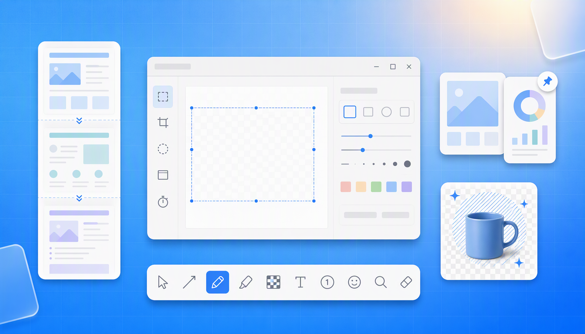
  
<strong>Shotera in breve.</strong> Dagli screenshot alle immagini lunghe, dal fissaggio alla registrazione, fino all’estrazione del testo e al ritocco AI: tutto in un’unica finestra.

</figure>

 

## Pensato per il lavoro dopo ogni screenshot

La parte difficile non è quasi mai la cattura: è tutto quello che viene dopo — annotare, oscurare, unire una pagina lunga, estrarre il testo, tenere un riferimento sotto gli occhi. Shotera raccoglie questo lavoro in un unico flusso, così la cattura è pronta nel momento stesso in cui la fai.

- **Niente passaggi aggiuntivi:** annota, oscura e ingrandisci nella stessa barra degli strumenti
- **Tutto ciò che è lungo, in un’unica immagine:** pagine lunghe, chat e documenti, uniti automaticamente
- **I riferimenti restano sotto gli occhi:** premi `F3` per fissare una cattura in primo piano mentre lavori

Usi comuni: feedback sul prodotto, segnalazioni di bug, tutorial e documentazione, risposte al supporto, revisioni di design, demo.

 

## Funzioni principali

### 📸 Screenshot · Un tasto, l’inquadratura esatta

Premi `F1`; passa il mouse e Shotera si aggancia alla finestra o al pulsante sotto il cursore, poi ritocca i bordi con la lente d’ingrandimento.

- Frecce, numerazione, testo e mosaico, applicati all’istante
- Dimensioni fisse, proporzioni, coordinate e ritardo per catture ripetibili

**In dettaglio:** aggancio ai bordi di finestre ed elementi dell’interfaccia, regolazioni al pixel, preset salvati e cattura con ritardo.

<figure>
  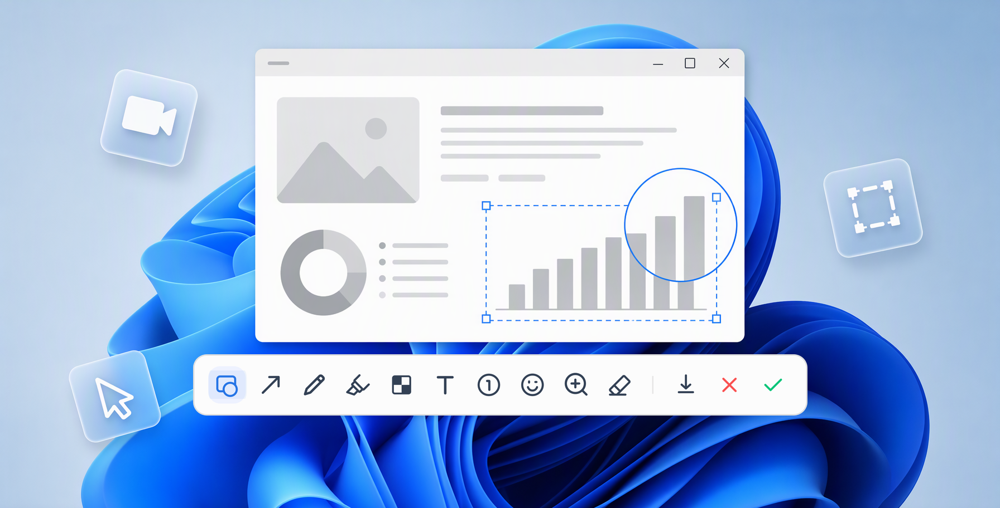
  
<strong>Cattura intelligente.</strong> Scegli una finestra o un elemento, poi annota direttamente nella barra degli strumenti.

</figure>

> **Due modi per concludere — cambi quando vuoi**
>
> **Elegante:** copiato all’istante, con una scheda in basso a destra che apre l’editor. **Annotazione immediata:** la barra compare insieme alla selezione, così annoti prima di copiare. Entrambe si trovano in Impostazioni → Cattura.

<figure>
  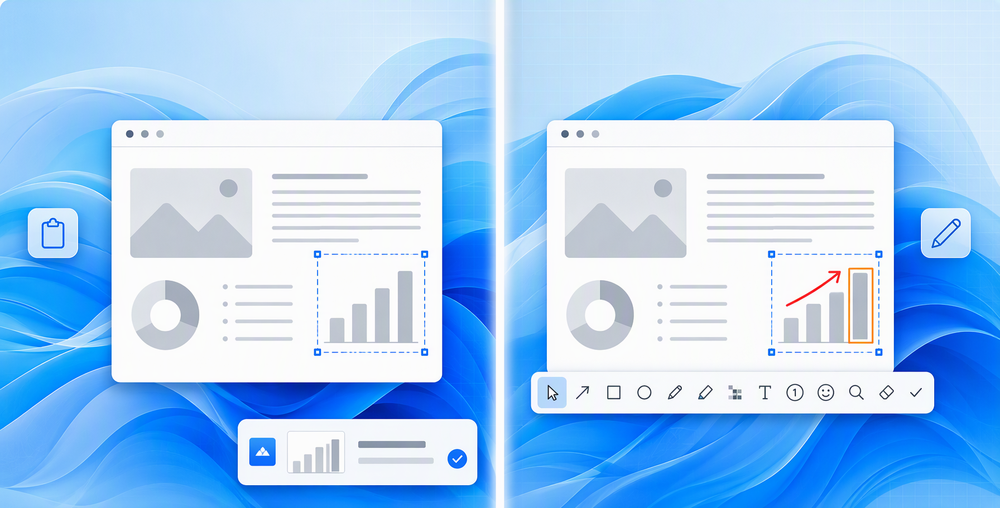
  
<strong>Due modi per concludere.</strong> A sinistra: Elegante; a destra: Annotazione immediata.

</figure>

### 📜 Screenshot lungo · Una pagina più alta dello schermo, in una sola cattura

Pagine lunghe, chat e documenti, catturati dall’alto verso il basso in un’unica immagine.

- Lascia scorrere Shotera o scorri tu: ogni fotogramma viene catturato
- I fotogrammi adiacenti vengono allineati e fusi, così non ci sono cuciture visibili
- Anteprima della composizione in tempo reale: fermati appena è completa

**In dettaglio:** pensato per pagine web lunghe, conversazioni e documenti interi; il risultato finisce direttamente in documenti e issue.

<figure>
  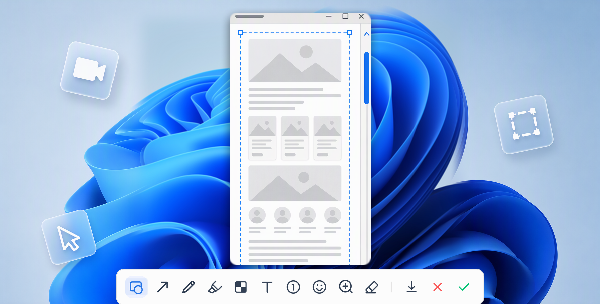
  
<strong>Screenshot lungo.</strong> Pagine e chat lunghe, unite in un’unica immagine.

</figure>

### 📌 Fissa sul desktop · Fissa i riferimenti in primo piano e lavora accanto

Premi `F3` per tenere una cattura sopra tutto il resto: confronta e prendi spunto senza cambiare finestra.

- Ridimensionamento, rotazione, trasparenza e clic passante
- Il doppio clic alterna dimensione originale e miniatura; l’ultima immagine fissata si ripristina con un clic

**In dettaglio:** trascina un bordo o un angolo per ridimensionare con le proporzioni bloccate; le immagini fissate restano sopra le finestre e non bloccano mai i clic.

<figure>
  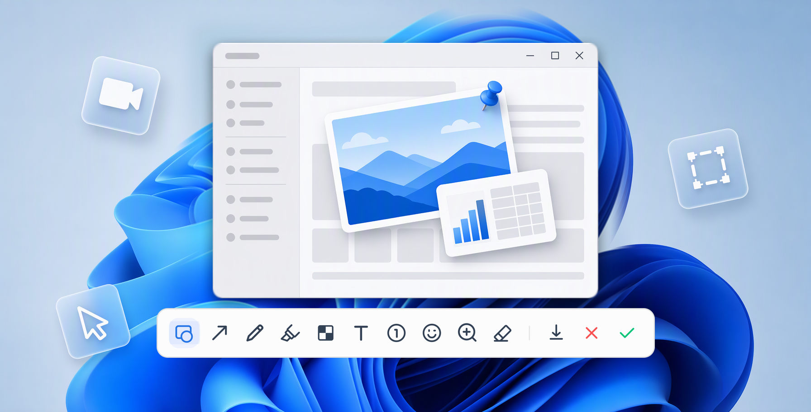
  
<strong>Fissa sul desktop.</strong> Tieni i riferimenti in primo piano mentre lavori.

</figure>

### 🎬 Registrazione schermo e GIF · Registra in 4K, per tutto il tempo che serve

Trasforma ciò che è “difficile da spiegare” in una clip che chiunque può seguire.

- 720p / 1080p / 2K / 4K a 30 o 60 fps, senza limiti di durata
- Cursore e clic in evidenza; esporta in MP4 o in una GIF leggera

**In dettaglio:** le GIF restano leggere per documenti, issue e chat, e le modalità ad alta risoluzione reggono anche sugli schermi HiDPI.

<figure>
  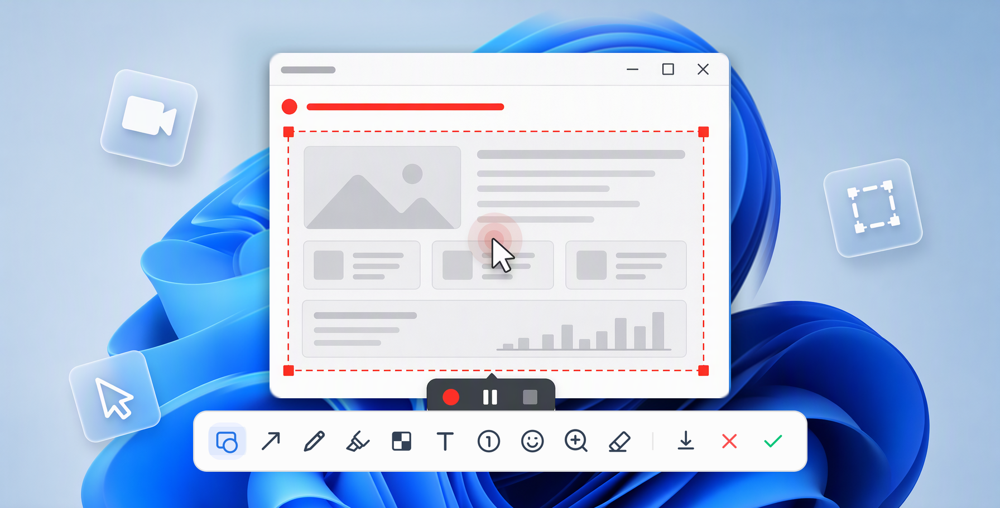
  
<strong>Registrazione schermo e GIF.</strong> Mostralo una volta invece di spiegarlo due.

</figure>

### 🔍 OCR offline e traduzione immagini · Trasforma i pixel in testo

- **OCR offline:** più lingue, copia e incolla in un colpo solo
- **Traduzione immagini:** leggi gli screenshot in lingua straniera nella tua lingua
- **Lettura di codici QR e a barre:** link, Wi-Fi, contatti e codici prodotto

**In dettaglio:** il riconoscimento avviene sul tuo dispositivo e i risultati sono a un clic dagli appunti.

<figure>
  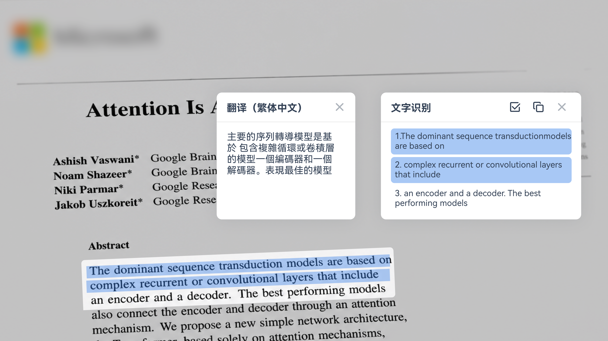
  
<strong>OCR offline e traduzione immagini.</strong> Estrai e traduci senza uscire dal flusso di cattura.

</figure>

### ✨ Scontorno AI e cancellazione AI · L’AI che completa lo screenshot per te

- **Scontorno AI:** persone, prodotti, loghi — un PNG trasparente in pochi secondi
- **Cancellazione AI:** elimina elementi indesiderati e filigrane; l’AI ricostruisce quello che c’era dietro

**In dettaglio:** entrambi si basano su modelli locali: l’immagine originale non viene mai caricata. Lo scontorno si può copiare o salvare come PNG trasparente.

<figure>
  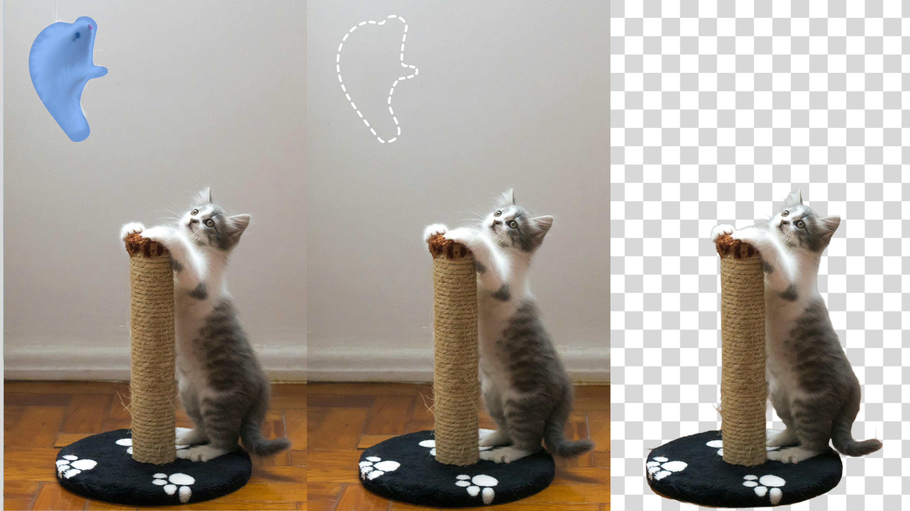
  
<strong>Scontorno AI.</strong> Soggetto e sfondo, separati in un unico passaggio.

</figure>

 

## Altre funzioni

### 🖊️ Annotazione e oscuramento

Frecce, testo, penna, evidenziatore, numerazione, lente d’ingrandimento; mosaico e sfocatura gaussiana per tutto ciò che è privato.

**In dettaglio:** le annotazioni si spostano, si ridimensionano e si ruotano, con annulla e ripristina quando cambi idea.

<figure>
  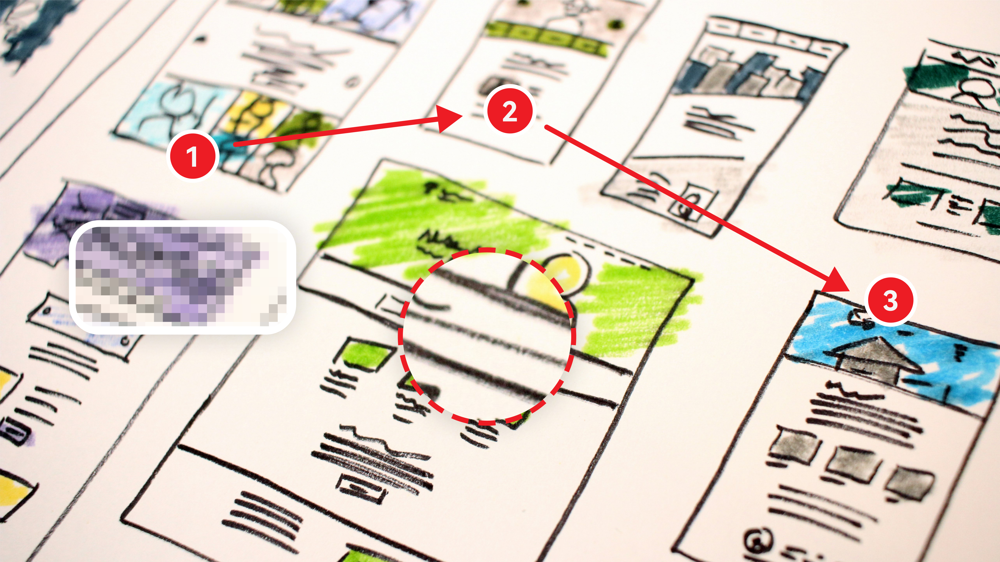
  
<strong>Annotazione e oscuramento.</strong> Spiega i passaggi con chiarezza e mantieni privato ciò che è sensibile.

</figure>

### 😀 Adesivi Emoji

Centinaia di adesivi, da ridimensionare e posizionare dove vuoi: un po’ di divertimento e molta più enfasi.

<figure>
  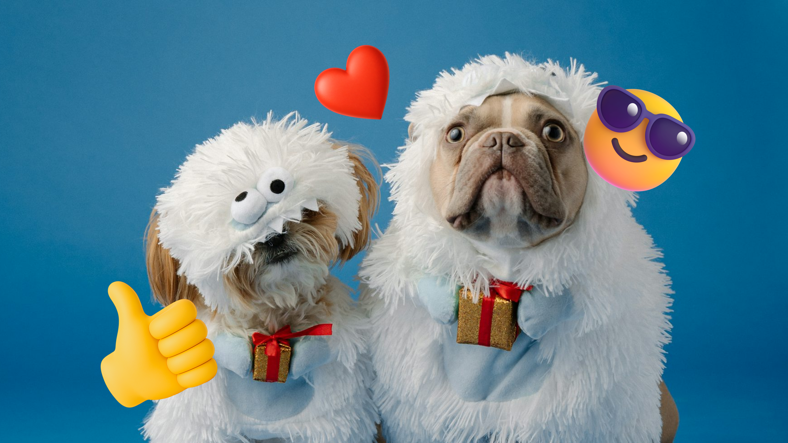
  
<strong>Adesivi Emoji.</strong> Attira l’attenzione esattamente su ciò che conta.

</figure>

### 🖥️ Modalità presentazione

Premi `Pause` per liberare il desktop dal disordine prima di una demo o di una registrazione; al termine tutto torna al suo posto.

<figure>
  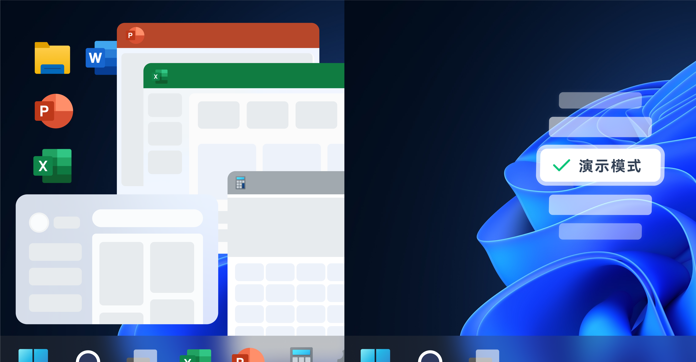
  
<strong>Modalità presentazione.</strong> Una pressione per mettere in ordine il desktop, una per ripristinarlo.

</figure>

### 🧰 Piccoli dettagli

- **Visualizzatore ed editor di immagini:** apri le catture in una finestra dedicata — sfoglia la cartella, ingrandisci, ritocca
- **Multi-monitor e HiDPI:** un unico spazio di coordinate tra gli schermi; resta nitido sui display ad alta densità
- **Modalità scura:** segui il sistema o scegli la tua
- **Esportazione e personalizzazione:** salvataggio rapido, salvataggio automatico e modelli per i nomi dei file; scorciatoie, lingua, caratteri e avvio personalizzabili

 

## FAQ

**Serve una connessione a internet?**
Gli screenshot e la modifica avvengono sul tuo computer; anche OCR offline, scontorno AI e cancellazione AI funzionano sul tuo dispositivo.

**Quali scorciatoie usa?**
`F1` cattura · `F3` fissa · `Pause` Modalità presentazione.

**Come faccio a catturare una pagina lunga?**
Passa a Screenshot lungo e scorri: i fotogrammi vengono uniti automaticamente in un’unica immagine.

Trovi altre risposte nelle [FAQ sul sito web](https://shotera.mosuzo.com/it/faq).

 

## Un flusso Windows mirato

1. Annota all’istante (Annotazione immediata), oppure copia subito e modifica dopo (Elegante).
2. I contenuti lunghi passano a Screenshot lungo; ti serve una demo? Registra una clip con Registrazione schermo e GIF.
3. Salva, copia o condividi; premi `F3` quando vuoi la cattura accanto a te.

 

## Privacy e controllo

Gli screenshot vengono salvati in locale; OCR offline, scontorno AI e cancellazione AI funzionano sul tuo dispositivo, quindi l’elaborazione non carica i tuoi screenshot. Per i dettagli, leggi l’[informativa sulla privacy](https://shotera.mosuzo.com/it/privacy).

 

## Lingue supportate

Shotera è disponibile in **15 lingue dell’interfaccia**:

  <kbd>Inglese</kbd>
  <kbd>Cinese semplificato</kbd>
  <kbd>Cinese tradizionale</kbd>
  <kbd>Giapponese</kbd>
  <kbd>Portoghese brasiliano</kbd>
  <kbd>Spagnolo</kbd>
  <kbd>Tedesco</kbd>
  <kbd>Francese</kbd>
  <kbd>Italiano</kbd>
  <kbd>Coreano</kbd>
  <kbd>Russo</kbd>
  <kbd>Arabo</kbd>
  <kbd>Olandese</kbd>
  <kbd>Polacco</kbd>
  <kbd>Svedese</kbd>

 

## Parole chiave

Shotera; Shotera AI; Mosuzo Studio; strumento per screenshot; cattura con scorrimento; screenshot lungo; annotazione di screenshot; fissaggio sul desktop; registrazione schermo; registrazione GIF; scontorno AI; cancellazione AI; OCR offline; traduzione immagini

 

## Download ed edizioni

  
  

> **Requisiti:** Windows 10 / 11 (64-bit).
>
> **Edizioni:** Standard e Lite — vedi il [confronto delle versioni](https://shotera.mosuzo.com/it/versions).

 

## Supporto e feedback

Domande, suggerimenti e feedback sono sempre benvenuti.

  
  
  
  

 

## Supporta Shotera su Ko-fi

Se Shotera ti rende il lavoro più semplice, sostienici su Ko-fi: lì condividiamo anche gli aggiornamenti sullo sviluppo.

  <a href="https://ko-fi.com/mosuzo">
    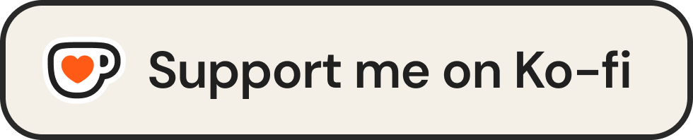
  </a>

---

  <a href="https://shotera.mosuzo.com">
    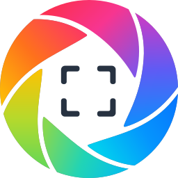
  </a>
  <strong>Mosuzo Studio</strong> · © 2026 Tutti i diritti riservati 
  Progettato per Windows, per rendere più rapidi screenshot, spiegazioni visive e riferimenti sul desktop.

  <a href="https://shotera.mosuzo.com">Sito web</a> ·
  <a href="https://shotera.mosuzo.com/it/versions">Versioni</a> ·
  <a href="https://shotera.mosuzo.com/it/changelog">Aggiornamenti</a> ·
  <a href="https://shotera.mosuzo.com/it/faq">FAQ</a> ·
  <a href="https://shotera.mosuzo.com/it/privacy">Privacy</a> ·
  <a href="https://github.com/mosuzo-studio/Shotera/issues">Feedback</a>

