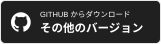

<h1 align="center">Shotera</h1>

<strong>正確にキャプチャし、わかりやすく伝え、仕事を前へ。</strong>

AI 画像ツール、オフライン OCR、スマート選択、画像翻訳、プレゼンテーションモードを備えた Windows 用スクリーンショット、注釈、デスクトップ固定アプリです。

  <a href="README.md">English</a> · <a href="README.zh-CN.md">简体中文</a> · <a href="README.zh-TW.md">繁體中文</a> · <strong><a href="README.ja.md">日本語</a></strong> · <a href="README.pt-BR.md">Português (Brasil)</a> · <a href="README.es.md">Español</a> · <a href="README.de.md">Deutsch</a> · <a href="README.fr.md">Français</a> · <a href="README.it.md">Italiano</a> · <a href="README.ko.md">한국어</a> · <a href="README.ru.md">Русский</a> · <a href="README.ar.md">العربية</a> · <a href="README.nl.md">Nederlands</a> · <a href="README.pl.md">Polski</a> · <a href="README.sv.md">Svenska</a>

  

 

<h3 align="center">Shotera をダウンロード</h3>

 

<strong>🧭 クイックナビゲーション</strong>

| Shotera を知る | 詳しく見る | はじめる |
| --- | --- | --- |
| [スクリーンショットの次の作業のために](#スクリーンショットの次の作業のために) [主な特長](#主な特長) [製品ギャラリー](#製品ギャラリー) | [全機能](#全機能) [Windows ワークフロー](#集中できる-windows-ワークフロー) [プライバシーと管理](#プライバシーと管理) [対応言語](#対応言語) [キーワード](#キーワード) | [ダウンロードとエディション](#ダウンロードとエディション) [サポートとフィードバック](#サポートとフィードバック) [Ko-fi で Shotera を応援](#ko-fi-で-shotera-を応援) |

<figure>
<strong>Shotera の全体像。</strong> スマートキャプチャ、AI ツール、注釈、オフライン OCR、画像翻訳を 1 つの Windows アプリで。
</figure>

 

## スクリーンショットの次の作業のために

Shotera はスクリーンショットを、説明、共有、再利用できる成果物に変えます。製品フィードバック、バグ報告、チュートリアル、ドキュメント、サポート、デザインレビュー、会議まで、キャプチャ、編集、文字抽出、デスクトップ参照を 1 つの流れにまとめます。

 

## 主な特長

- **スマートで正確なキャプチャ：** ウィンドウや入れ子の UI 要素を検出し、拡大鏡とピクセル単位の調整で範囲を整えます。
- **AI 画像編集：** AI 切り抜きで被写体を分離し、AI 消去で不要な内容を削除します。
- **オフライン OCR と画像翻訳：** 端末上でコピー可能な文字を抽出し、画像内の文字をすばやく翻訳できます。文字抽出のためにスクリーンショットをアップロードする必要はありません。
- **注釈とプライバシー保護：** 矢印、文字、手順番号、部分拡大、モザイク、ガウスぼかしで、明確に伝えながら機密情報を守ります。
- **デスクトップ固定とプレゼンテーションモード：** `F3` で資料を前面に固定し、`Pause` で会議前にデスクトップ上の不要な要素を隠します。

 

## 製品ギャラリー

<figure>
<strong>スマートキャプチャ。</strong> <code>F1</code> で開始し、ウィンドウや UI 要素を選んで、そのまま注釈できます。
</figure>

 

<figure>
<strong>注釈と墨消し。</strong> 矢印、手順番号、モザイク、部分拡大で手順を明確にし、機密情報を保護します。
</figure>

 

<figure>
<strong>オフライン OCR と画像翻訳。</strong> キャプチャの流れを離れずに文字を抽出し、画像を翻訳します。
</figure>

 

<figure>
<strong>AI 切り抜き。</strong> 被写体と背景を分離し、透過素材をワンステップで作成します。
</figure>

 

<figure>
<strong>絵文字ステッカー。</strong> 拡大縮小できる視覚的な強調を加え、スクリーンショットを理解しやすくします。
</figure>

 

<figure>
<strong>プレゼンテーションモード。</strong> <code>Pause</code> で会議前にデスクトップ上の不要な要素を隠し、後で元に戻します。
</figure>

 

<figure>
<strong>ひとつにまとまったビジュアルツール。</strong> キャプチャ、注釈、OCR、翻訳、GIF 作成、絵文字を 1 つのアプリで使えます。
</figure>

 

## 全機能

1. **キャプチャ：** `F1` で領域、ウィンドウ、UI 要素、全画面を撮影。固定サイズ、縦横比、座標、遅延、プリセットも設定できます。
2. **AI 画像編集：** AI 切り抜きで透過素材を作り、AI 消去で不要な内容を整えます。
3. **OCR と翻訳：** スクリーンショット、画像、文書から文字をローカル抽出し、画像内の文字も翻訳します。
4. **注釈と墨消し：** 図形、矢印、文字、手描き、ハイライト、手順番号、絵文字、部分拡大を追加し、モザイクやガウスぼかしで情報を隠します。
5. **デスクトップ固定：** `F3` でスクリーンショットや対応するクリップボード画像、文字、色を固定し、透明度、回転、反転、クリック透過、表示を調整します。
6. **プレゼンテーションモード：** `Pause` でデスクトップのアイコンや不要な要素を隠し、終了後に復元します。
7. **編集と出力：** 注釈の移動、拡大縮小、回転、スタイル変更、元に戻す、やり直しに対応。クイック保存、自動保存、ファイル名テンプレート、複数形式で出力できます。
8. **カスタマイズ：** ショートカット、表示言語、フォント、起動方法、トレイアイコンを設定できます。

 

## 集中できる Windows ワークフロー

1. `F1` を押し、自由領域、ウィンドウ、UI 要素、全画面から選びます。
2. スマート UI 検出と拡大鏡で境界を調整します。
3. 注釈、墨消し、文字抽出、翻訳、AI 画像編集を行います。
4. 保存または共有し、必要なら `F3` でデスクトップに固定します。

 

## プライバシーと管理

Shotera はキャプチャをローカルに保存します。オフライン OCR は端末上で動作するため、文字抽出時にスクリーンショットをアップロードする必要はありません。ショートカット、表示言語とフォント、起動方法、トレイアイコンも設定できます。

詳しくは[プライバシーポリシー](https://shotera.mosuzo.com/en/privacy)をご覧ください。

 

## 対応言語

Shotera は **15 のインターフェイス言語**に対応しています。

<kbd>English</kbd> <kbd>简体中文</kbd> <kbd>繁體中文</kbd> <kbd>日本語</kbd> <kbd>Português (Brasil)</kbd> <kbd>Español</kbd> <kbd>Deutsch</kbd> <kbd>Français</kbd> <kbd>Italiano</kbd> <kbd>한국어</kbd> <kbd>Русский</kbd> <kbd>العربية</kbd> <kbd>Nederlands</kbd> <kbd>Polski</kbd> <kbd>Svenska</kbd>

 

## キーワード

Shotera；Shotera AI；Mosuzo Studio；AI 切り抜き；AI 画像修復；オフライン OCR；画面キャプチャ；スクリーンショット編集；画像注釈；デスクトップ固定；画像翻訳

 

## ダウンロードとエディション

 

> **エディションについて：** 基本エディションの機能は永続的に無料です。一部の高度な機能には Pro が必要で、提供状況はリリースによって異なる場合があります。

 

## サポートとフィードバック

ご質問、ご提案、フィードバックをいつでもお寄せください。

   

 

## Ko-fi で Shotera を応援

Shotera が仕事を楽にしているなら、ご支援は継続的な開発と新機能の提供に役立ちます。Ko-fi では最近の開発状況も共有します。

---

 <strong>Mosuzo Studio</strong> · Copyright © 2026. All rights reserved. Shotera は Windows 向けに設計され、画面キャプチャ、視覚的なコミュニケーション、デスクトップ参照を効率化します。

