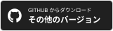

  

<h1 align="center">Shotera</h1>

  <strong>正確にキャプチャし、わかりやすく伝え、仕事を前へ。</strong> 
  スクリーンショット · 長尺キャプチャ · 画面に固定 · 画面録画 & GIF · オフライン OCR · AI 切り抜き & AI 消去

  Windows のキャプチャアプリ。すばやく撮って、すぐ注釈、手元に置ける； 
  すぐにコピー、またはその場で注釈。

  
  
  

  
  
  
  

  <a href="README.md">English</a> ·
  <a href="README.zh-CN.md">简体中文</a> ·
  <a href="README.zh-TW.md">繁體中文</a> ·
  <strong><a href="README.ja.md">日本語</a></strong> ·
  <a href="README.pt-BR.md">Português (Brasil)</a> ·
  <a href="README.es.md">Español</a> ·
  <a href="README.de.md">Deutsch</a> ·
  <a href="README.fr.md">Français</a> ·
  <a href="README.it.md">Italiano</a> ·
  <a href="README.ko.md">한국어</a> ·
  <a href="README.ru.md">Русский</a> ·
  <a href="README.ar.md">العربية</a> ·
  <a href="README.nl.md">Nederlands</a> ·
  <a href="README.pl.md">Polski</a> ·
  <a href="README.sv.md">Svenska</a>

 

  <strong>Shotera をダウンロード</strong> · Windows 10 / 11 (64-bit)

  
  

<strong>🧭 クイックナビゲーション</strong>

| 主な機能 | 詳しく見る | はじめる |
| --- | --- | --- |
| [コア機能](#コア機能)：スクリーンショット · 長尺キャプチャ · 画面に固定 · 画面録画 & GIF · オフライン OCR · AI 切り抜き & AI 消去 [その他の機能](#その他の機能)：注釈と墨消し · 絵文字ステッカー · デモモード · ダークモード · マルチモニター | [スクリーンショットの次の作業のために](#スクリーンショットの次の作業のために) [よくある質問](#よくある質問) [Windows ワークフロー](#集中できる-windows-ワークフロー) [プライバシーと管理](#プライバシーと管理) [対応言語](#対応言語) | [ダウンロードとエディション](#ダウンロードとエディション) [サポートとフィードバック](#サポートとフィードバック) [Ko-fi で Shotera を応援](#ko-fi-で-shotera-を応援) |

> **はじめの3ステップ：** ① インストール → ② `F1` を押して範囲を選択 → ③ 注釈を付けてコピー、または `F3` で画面に固定。

<figure>
  
  
<strong>Shotera の全体像。</strong> スクリーンショットから長尺キャプチャ、画面に固定、画面録画、文字抽出、AI 処理まで——すべてひとつのウィンドウで。

</figure>

 

## スクリーンショットの次の作業のために

難しいのは、撮ることそのものより、そのあとの作業です。注釈、墨消し、長いページのつなぎ合わせ、文字の抽出、参考資料を視界に保つこと。Shotera はそのすべてをひとつの流れにまとめ、撮ったその瞬間から使える状態にします。

- **後工程なし：** 注釈、墨消し、拡大まで、同じツールバーで
- **長い内容も 1 枚に：** 長いページ、チャット、文書を自動でつなぎ合わせ
- **参考資料は視界に：** `F3` でキャプチャを最前面に固定して、そのまま作業

よくある用途：製品フィードバック、不具合報告、チュートリアルやドキュメント、サポート対応、デザインレビュー、デモ。

 

## コア機能

### 📸 スクリーンショット · キーひとつで、狙った範囲ぴったり

`F1` を押してマウスを重ねると、下にあるウィンドウやボタンを自動でとらえます。境界はルーペで細かく調整できます。

- 矢印、連番、テキスト、モザイクを、撮ったその場で追加できます
- 固定サイズ、縦横比、座標、遅延を指定して、繰り返しの撮影も簡単です

**詳細：** ウィンドウと UI 要素の境界への吸着、ピクセル単位の微調整、プリセットの保存、遅延キャプチャに対応します。

<figure>
  
  
<strong>スマートキャプチャ。</strong> ウィンドウやコントロールを選んだら、そのままツールバーで注釈できます。

</figure>

> **2つの完了モード、いつでも切り替え**
>
> **エレガント**：範囲を離した瞬間にクリップボードへコピー。右下の通知をクリックすると、エディターで注釈を続けられます。**その場で注釈**：範囲を選ぶとツールバーが開き、コピーする前にそのまま描き込めます。どちらも「設定 → キャプチャ」で切り替えられます。

<figure>
  
  
<strong>2つの完了モード。</strong> 左：エレガント、右：その場で注釈。

</figure>

### 📜 長尺キャプチャ · 画面より長いページも、1枚で

長いページ、長いチャット、文書まるごとを、上から下まで1枚の画像に収めます。

- 自動スクロールでも、自分の手でスクロールしても。スクロールしながら1コマずつ取り込まれます
- 隣り合うフレームを照合してなめらかにつなぐので、仕上がった長い画像に継ぎ目は見えません
- リアルタイムの結合プレビューで、すべて入った瞬間に停止できます

**詳細：** 長いウェブページ、長いチャット、文書まるごとのために。仕上がった長い画像は、ドキュメントや Issue にそのまま使えます。

<figure>
  
  
<strong>長尺キャプチャ。</strong> 長いページもチャットも、1枚の画像につなぎ合わせます。

</figure>

### 📌 画面に固定 · 参考資料は最前面に、作業はその隣で

`F3` を押すと、キャプチャが常に最前面に浮かびます。ウィンドウを切り替えずに比較・参照できます。

- 拡大縮小、回転、半透明、マウスパススルーに対応
- ダブルクリックで元のサイズとサムネイルを切り替え。閉じた直前の固定はワンクリックで復元できます

**詳細：** どの辺や角からでもリサイズでき、縦横比は固定。固定した画像は常にウィンドウの上に表示され、クリックを遮りません。

<figure>
  
  
<strong>画面に固定。</strong> 参考資料を最前面に置いたまま、作業を続けられます。

</figure>

### 🎬 画面録画 & GIF · 4K 録画、必要なだけ長く

「説明しにくい」ことを、誰でも追えるクリップに変えます。

- 720p / 1080p / 2K / 4K、30 / 60 fps、録画時間の制限なし
- カーソルとクリックを強調し、MP4 か軽量な GIF に書き出せます

**詳細：** GIF はドキュメントや Issue、チャットに貼れる軽さ。高解像度モードは高 DPI のディスプレイでも鮮明さを保ちます。

<figure>
  
  
<strong>画面録画 & GIF。</strong> 一度見せれば、二度説明する必要はありません。

</figure>

### 🔍 オフライン OCR と画像翻訳 · 画像の中の文字を、テキストに戻す

- **オフライン OCR：** 多言語に対応し、コピーしてそのまま貼り付けられます
- **画像翻訳：** 外国語のスクリーンショットを、自分の言語ですぐに読めます
- **QR コード認識：** リンク、Wi-Fi、連絡先、商品コードに対応

**詳細：** 認識は端末上で実行され、結果はワンクリックでクリップボードへ。

<figure>
  
  
<strong>オフライン OCR と画像翻訳。</strong> キャプチャの流れを離れずに、文字を抽出し、翻訳できます。

</figure>

### ✨ AI 切り抜き & AI 消去 · スクリーンショットの仕上げを担う AI

- **AI 切り抜き：** 人物、商品、ロゴ——数秒で透明 PNG に
- **AI 消去：** 余計なものやウォーターマークを消し、AI が背景を自然に補完します

**詳細：** どちらもローカルモデルで動作し、元の画像がアップロードされることはありません。切り抜き結果はコピー、または透明 PNG として保存できます。

<figure>
  
  
<strong>AI 切り抜き。</strong> 被写体と背景を、ワンステップで分離。

</figure>

 

## その他の機能

### 🖊️ 注釈と墨消し

矢印、テキスト、ペン、蛍光ペン、連番、ルーペ。機密情報にはモザイクとガウスぼかしを。

**詳細：** 注釈は移動、拡大縮小、回転ができ、気が変わったときはいつでも元に戻す・やり直しができます。

<figure>
  
  
<strong>注釈と墨消し。</strong> 手順はわかりやすく、見せたくない部分は安全に。

</figure>

### 😀 絵文字ステッカー

数百種類のステッカーを、サイズも置き場所も自由に——少しの遊び心と、もっと強い強調を。

<figure>
  
  
<strong>絵文字ステッカー。</strong> 見てほしいポイントへ、視線を導きます。

</figure>

### 🖥️ デモモード

デモや録画の前に `Pause` を押すと、散らかったデスクトップを片付けられます。終わったあとは、すべて元どおりに戻ります。

<figure>
  
  
<strong>デモモード。</strong> ひと押しでデスクトップを片付け、もうひと押しで元どおり。

</figure>

### 🧰 小さなこだわり

- **画像ビューアーとエディター：** スクリーンショットを専用ウィンドウで開き、フォルダー内をめくって拡大、その場で修正
- **マルチモニターと高 DPI：** 複数の画面をひとつの座標系で扱い、高 DPI でも鮮明なまま
- **ダークモード：** システムに従うか、自分で選ぶ
- **書き出しとカスタマイズ：** クイック保存、自動保存、ファイル名テンプレート。ショートカット、言語、フォント、起動方法もカスタマイズ可能

 

## よくある質問

**インターネット接続は必要ですか？**
スクリーンショットと編集はお使いの PC 上で実行されます。オフライン OCR、AI 切り抜き、AI 消去も端末上で動作します。

**ショートカットは何を使いますか？**
`F1` キャプチャ · `F3` 画面に固定 · `Pause` デモモード。

**長いページはどうやって撮りますか？**
長尺キャプチャに切り替えてスクロールするだけ。フレームは自動で1枚の画像につなぎ合わされます。

そのほかのご質問は、[公式サイトのよくある質問](https://shotera.mosuzo.com/ja/faq)をご覧ください。

 

## 集中できる Windows ワークフロー

1. すぐ注釈を付ける（その場で注釈）、または先にコピーして後から編集する（エレガント）。
2. 長い内容は長尺キャプチャへ。デモが必要なら、画面録画 & GIF でクリップを録ります。
3. 保存、コピー、または共有。手元に置きたいときは `F3` で画面に固定します。

 

## プライバシーと管理

スクリーンショットはローカルに保存されます。オフライン OCR、AI 切り抜き、AI 消去は端末上で実行されるため、その処理でスクリーンショットがアップロードされることはありません。詳しくは[プライバシーポリシー](https://shotera.mosuzo.com/ja/privacy)をご覧ください。

 

## 対応言語

Shotera は **15 のインターフェイス言語**に対応しています：

  <kbd>英語</kbd>
  <kbd>簡体字中国語</kbd>
  <kbd>繁体字中国語</kbd>
  <kbd>日本語</kbd>
  <kbd>ブラジルポルトガル語</kbd>
  <kbd>スペイン語</kbd>
  <kbd>ドイツ語</kbd>
  <kbd>フランス語</kbd>
  <kbd>イタリア語</kbd>
  <kbd>韓国語</kbd>
  <kbd>ロシア語</kbd>
  <kbd>アラビア語</kbd>
  <kbd>オランダ語</kbd>
  <kbd>ポーランド語</kbd>
  <kbd>スウェーデン語</kbd>

 

## キーワード

Shotera；Shotera AI；Mosuzo Studio；スクリーンショットツール；長尺キャプチャ；長いスクリーンショット；スクリーンショット注釈；画面に固定；画面録画；GIF 録画；AI 切り抜き；AI 消去；オフライン OCR；画像翻訳

 

## ダウンロードとエディション

  
  

> **システム要件：** Windows 10 / 11 (64-bit)。
>
> **エディション：** Standard 版と Lite 版があります。機能の違いは[バージョン比較](https://shotera.mosuzo.com/ja/versions)をご覧ください。

 

## サポートとフィードバック

ご質問、ご提案、フィードバックをいつでもお寄せください。

  
  
  
  

 

## Ko-fi で Shotera を応援

Shotera がお仕事を楽にしてくれるなら、Ko-fi でのご支援をお願いします。開発の最新情報もそこで共有しています。

  

---

  
  <strong>Mosuzo Studio</strong> · © 2026 All rights reserved 
  Shotera は Windows のために作られ、スクリーンショット、視覚的な説明、デスクトップ参照をより速くします。

  <a href="https://shotera.mosuzo.com">公式サイト</a> ·
  <a href="https://shotera.mosuzo.com/ja/versions">バージョン比較</a> ·
  <a href="https://shotera.mosuzo.com/ja/changelog">更新履歴</a> ·
  <a href="https://shotera.mosuzo.com/ja/faq">よくある質問</a> ·
  <a href="https://shotera.mosuzo.com/ja/privacy">プライバシーポリシー</a> ·
  <a href="https://github.com/mosuzo-studio/Shotera/issues">フィードバック</a>

