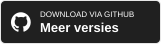

<h1 align="center">Shotera</h1>

<strong>Leg nauwkeurig vast. Leg helder uit. Blijf doorwerken.</strong>

Een Windows-app voor schermafbeeldingen, annotaties en bureaubladpinnen, met AI-beeldtools, offline OCR, slimme selectie, beeldvertaling en Presentatiemodus.

<a href="README.md">English</a> · <a href="README.zh-CN.md">简体中文</a> · <a href="README.zh-TW.md">繁體中文</a> · <a href="README.ja.md">日本語</a> · <a href="README.pt-BR.md">Português (Brasil)</a> · <a href="README.es.md">Español</a> · <a href="README.de.md">Deutsch</a> · <a href="README.fr.md">Français</a> · <a href="README.it.md">Italiano</a> · <a href="README.ko.md">한국어</a> · <a href="README.ru.md">Русский</a> · <a href="README.ar.md">العربية</a> · <strong><a href="README.nl.md">Nederlands</a></strong> · <a href="README.pl.md">Polski</a> · <a href="README.sv.md">Svenska</a>

 

<h3 align="center">Shotera downloaden</h3>

 

<figure>
<strong>Shotera in één oogopslag.</strong> Slim vastleggen, AI, annotatie, offline OCR en beeldvertaling in één Windows-app.
</figure>
 
## Gemaakt voor het werk na elke schermafbeelding

Shotera maakt een schermafbeelding klaar om uit te leggen, te delen of opnieuw te gebruiken, voor feedback, bugrapporten, handleidingen, documentatie, support en vergaderingen.
 
## Belangrijkste functies

- **Slim en nauwkeurig vastleggen:** vensters en UI-elementen herkennen en per pixel bijstellen.
- **AI-beeldbewerking:** onderwerpen vrijstaand maken en ongewenste inhoud verwijderen.
- **Offline OCR en beeldvertaling:** tekst lokaal extraheren en beeldtekst vertalen zonder uploads voor tekstherkenning.
- **Annotatie en privacy:** pijlen, tekst, stappen, vergroting, mozaïek en vervaging.
- **Bureaubladpinnen en Presentatiemodus:** `F3` pint referenties vast, `Pause` verbergt afleiding.
 
## Productgalerij

<figure>
<strong>Slim vastleggen.</strong> Start met <code>F1</code>, kies een venster of element en annoteer direct.
</figure> 
<figure>
<strong>Annotatie en afscherming.</strong> Leg stappen uit en bescherm gevoelige inhoud.
</figure> 
<figure>
<strong>OCR en vertaling.</strong> Extraheer en vertaal tekst in dezelfde workflow.
</figure> 
<figure>
<strong>AI Cutout.</strong> Scheid onderwerp en achtergrond.
</figure> 
<figure>
<strong>Emoji-stickers.</strong> Voeg duidelijke visuele nadruk toe.
</figure> 
<figure>
<strong>Presentatiemodus.</strong> Verberg afleiding met <code>Pause</code>.
</figure> 
<figure>
<strong>Complete visuele toolkit.</strong> Vastleggen, annotatie, OCR, vertaling, GIF en Emoji.
</figure>
 
## Volledige functies

1. **Vastleggen:** regio, venster, UI-element of volledig scherm via `F1`, met afmetingen, verhouding, vertraging en presets.
2. **AI-bewerking:** transparante beelden maken en ongewenste inhoud wissen.
3. **OCR en vertaling:** tekst lokaal extraheren uit afbeeldingen en documenten of beeldtekst vertalen.
4. **Annotatie:** vormen, pijlen, tekst, tekenen, stappen, Emoji, vergroting, mozaïek en vervaging.
5. **Bureaubladpinnen:** via `F3` vastpinnen en dekking, rotatie, spiegeling, doorklikken en zichtbaarheid aanpassen.
6. **Presentatiemodus:** pictogrammen en afleiding met `Pause` verbergen en herstellen.
7. **Bewerking en uitvoer:** verplaatsen, schalen, draaien, ongedaan maken, automatisch opslaan en meerdere formaten.
8. **Personalisatie:** sneltoetsen, taal, lettertypen, opstarten en systeemvakpictogrammen.
 
## Privacy en controle

Shotera bewaart opnamen lokaal. Offline OCR draait op je apparaat, dus uploads zijn niet nodig voor tekstextractie. Lees het [Privacybeleid](https://shotera.mosuzo.com/privacy).
 
## Ondersteunde talen

Shotera ondersteunt **15 interfacetalen**: English, 简体中文, 繁體中文, 日本語, Português, Español, Deutsch, Français, Italiano, 한국어, Русский, العربية, Nederlands, Polski en Svenska.
 
## Trefwoorden

Shotera; Shotera AI; Mosuzo Studio; AI Cutout; offline OCR; schermopname; screenshot-editor; beeldannotatie; bureaubladpin; beeldvertaling
 
## Download en edities

 

> **Versie-informatie:** De functies van de basisversie blijven altijd gratis. Sommige geavanceerde functies vereisen Pro; het beschikbare aanbod kan per versie verschillen.
 
## Ondersteuning en feedback

   

 
## Steun Shotera op Ko-fi

Als Shotera je werk makkelijker maakt, helpt je steun ons door te ontwikkelen en nieuwe functies te bouwen.

---

 <strong>Mosuzo Studio</strong> · Copyright © 2026. Alle rechten voorbehouden.

