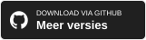

  

<h1 align="center">Shotera</h1>

  <strong>Leg nauwkeurig vast. Leg helder uit. Blijf doorwerken.</strong> 
  Schermafbeelding · Lange schermafbeelding · Vastpinnen op bureaublad · Schermopname & GIF · Offline OCR · AI-uitsnede & AI-gum

  Een Windows-app voor vastleggen: snel geschoten, snel geannoteerd, altijd binnen handbereik; 
  direct kopiëren, of meteen annoteren.

  
  
  

  
  
  
  

  <a href="README.md">English</a> ·
  <a href="README.zh-CN.md">简体中文</a> ·
  <a href="README.zh-TW.md">繁體中文</a> ·
  <a href="README.ja.md">日本語</a> ·
  <a href="README.pt-BR.md">Português (Brasil)</a> ·
  <a href="README.es.md">Español</a> ·
  <a href="README.de.md">Deutsch</a> ·
  <a href="README.fr.md">Français</a> ·
  <a href="README.it.md">Italiano</a> ·
  <a href="README.ko.md">한국어</a> ·
  <a href="README.ru.md">Русский</a> ·
  <a href="README.ar.md">العربية</a> ·
  <strong><a href="README.nl.md">Nederlands</a></strong> ·
  <a href="README.pl.md">Polski</a> ·
  <a href="README.sv.md">Svenska</a>

 

  <strong>Shotera downloaden</strong> · Windows 10 / 11 (64-bit)

  
  

<strong>🧭 Snelle navigatie</strong>

| Wat het doet | Meer weten | Aan de slag |
| --- | --- | --- |
| [Kernfuncties](#kernfuncties): Schermafbeelding · Lange schermafbeelding · Vastpinnen op bureaublad · Schermopname & GIF · Offline OCR · AI-uitsnede & AI-gum [Meer functies](#meer-functies): annotatie en afscherming · Emoji-stickers · Presentatiemodus · donkere modus · meerdere monitoren | [Gemaakt voor het werk na elke schermafbeelding](#gemaakt-voor-het-werk-na-elke-schermafbeelding) [FAQ](#faq) [Windows-workflow](#een-gerichte-windows-workflow) [Privacy en controle](#privacy-en-controle) [Ondersteunde talen](#ondersteunde-talen) | [Download en edities](#download-en-edities) [Ondersteuning en feedback](#ondersteuning-en-feedback) [Steun Shotera op Ko-fi](#steun-shotera-op-ko-fi) |

> **Drie stappen om te beginnen:** ① installeren → ② op `F1` drukken en het gebied afbakenen → ③ annoteren en kopiëren, of op `F3` drukken om de opname op je bureaublad vast te pinnen.

<figure>
  
  
<strong>Shotera in één oogopslag.</strong> Van schermafbeeldingen en lange pagina’s tot vastpinnen, opnemen, tekstextractie en AI-afwerking — alles in één venster.

</figure>

 

## Gemaakt voor het werk na elke schermafbeelding

Het moeilijke zit zelden in het vastleggen zelf — het zit in alles daarna: annoteren, afschermen, een lange pagina aan elkaar zetten, tekst eruit halen, een referentie in het zicht houden. Shotera brengt dat werk samen in één flow, zodat een opname klaar is zodra je hem maakt.

- **Geen tweede ronde nodig:** annoteer, scherm af en vergroot vanuit dezelfde werkbalk
- **Alles wat lang is in één afbeelding:** lange pagina’s, chats en documenten, automatisch samengevoegd
- **Referenties blijven in zicht:** druk op `F3` om een opname bovenop vast te pinnen terwijl je werkt

Veelgebruikte toepassingen: productfeedback, bugmeldingen, tutorials en documentatie, supportreacties, designreviews en demo’s.

 

## Kernfuncties

### 📸 Schermafbeelding · Eén toets, precies het juiste kader

Druk op `F1`; beweeg de muis en Shotera klikt vast op het venster of de knop eronder — daarna stel je de randen bij met de loep.

- Pijlen, nummering, tekst en mozaïek, direct toegepast
- Vaste afmetingen, verhouding, coördinaten en vertraging voor herhaalbare opnamen

**Details:** het automatisch vastklikken op vensters en UI-elementen, bijstellen tot op de pixel, opgeslagen voorinstellingen en vertraagde opname.

<figure>
  
  
<strong>Slim vastleggen.</strong> Kies een venster of element en annoteer direct in de werkbalk.

</figure>

> **Twee manieren om af te ronden — wissel wanneer je wilt**
>
> **Strak en simpel:** direct gekopieerd zodra je loslaat; de melding rechtsonder opent de editor. **Direct annoteren:** de werkbalk verschijnt met de selectie, zodat je eerst tekent en dan kopieert. Je vindt beide in Instellingen → Schermafbeelding.

<figure>
  
  
<strong>Twee manieren om af te ronden.</strong> Links: Strak en simpel; rechts: Direct annoteren.

</figure>

### 📜 Lange schermafbeelding · Een pagina langer dan het scherm, in één opname

Lange pagina’s, lange chats en complete documenten — van boven tot onder vastgelegd in één afbeelding.

- Laat automatisch scrollen of scroll zelf — elk beeld wordt onderweg vastgelegd
- Aangrenzende beelden worden op elkaar afgestemd en samengevoegd, zodat er geen zichtbare naden zijn
- Live voorbeeld van het samenvoegen: stop zodra alles erin staat

**Details:** gemaakt voor lange webpagina’s, chatgesprekken en complete documenten; het resultaat gaat direct naar documentatie en issues.

<figure>
  
  
<strong>Lange schermafbeelding.</strong> Lange pagina’s en chats, aan elkaar gezet tot één afbeelding.

</figure>

### 📌 Vastpinnen op bureaublad · Referenties bovenop, werk ernaast verder

Druk op `F3` om een opname bovenop alles te houden — vergelijk en raadpleeg zonder van venster te wisselen.

- Schalen, roteren, transparant maken en doorklikken
- Dubbelklik schakelt tussen de oorspronkelijke grootte en de miniatuur; de laatst gesloten vastgepinde opname zet je met één klik terug

**Details:** sleep elke rand of hoek om te schalen met vergrendelde beeldverhouding; vastgepinde opnamen blijven boven je vensters en blokkeren nooit je klikken.

<figure>
  
  
<strong>Vastpinnen op bureaublad.</strong> Houd referenties bovenop terwijl je werkt.

</figure>

### 🎬 Schermopname & GIF · Neem op in 4K, zo lang als nodig is

Maak van «moeilijk uit te leggen» een opname die iedereen kan volgen.

- 720p / 1080p / 2K / 4K bij 30 of 60 fps, zonder tijdslimiet
- Cursor- en klikaccenten; exporteer naar MP4 of een lichtgewicht GIF

**Details:** GIF’s blijven klein genoeg voor documentatie, issues en chat, en de hoge resoluties blijven scherp op HiDPI-schermen.

<figure>
  
  
<strong>Schermopname & GIF.</strong> Laat het één keer zien in plaats van het twee keer uit te leggen.

</figure>

### 🔍 Offline OCR & beeldvertaling · Zet pixels weer om in tekst

- **Offline OCR:** meerdere talen, in één keer kopiëren en plakken
- **Beeldvertaling:** lees buitenlandse schermafbeeldingen in je eigen taal
- **QR- en barcodes scannen:** links, Wi-Fi, contacten en productcodes

**Details:** de herkenning draait op je apparaat, en resultaten staan met één klik op het klembord.

<figure>
  
  
<strong>Offline OCR & beeldvertaling.</strong> Extraheer en vertaal zonder de opnameflow te verlaten.

</figure>

### ✨ AI-uitsnede & AI-gum · AI die je schermafbeelding voor je afmaakt

- **AI-uitsnede:** personen, producten, logo’s — binnen enkele seconden een transparante PNG
- **AI-gum:** ruim rommel en watermerken op; AI herstelt wat erachter zat

**Details:** beide draaien op lokale modellen — de originele afbeelding wordt nooit geüpload. Uitsnedes kun je kopiëren of opslaan als transparante PNG.

<figure>
  
  
<strong>AI-uitsnede.</strong> Onderwerp en achtergrond in één stap gescheiden.

</figure>

 

## Meer functies

### 🖊️ Annotatie en afscherming

Pijlen, tekst, penseel, markeerstift, nummering en loep; mozaïek en Gaussiaanse vervaging voor alles wat privé moet blijven.

**Details:** annotaties kun je verplaatsen, schalen en roteren, met ongedaan maken en opnieuw uitvoeren wanneer je van gedachten verandert.

<figure>
  
  
<strong>Annotatie en afscherming.</strong> Leg stappen duidelijk uit en houd gevoelige delen privé.

</figure>

### 😀 Emoji-stickers

Honderden stickers, overal te schalen en te plaatsen — een beetje plezier, en veel meer nadruk.

<figure>
  
  
<strong>Emoji-stickers.</strong> Trek de blik precies naar wat belangrijk is.

</figure>

### 🖥️ Presentatiemodus

Druk op `Pause` om rommel op te ruimen voor een demo of een opname; daarna wordt alles weer teruggezet.

<figure>
  
  
<strong>Presentatiemodus.</strong> Eén druk om het bureaublad op te ruimen, één druk om het terug te draaien.

</figure>

### 🧰 Kleine details

- **Beeldviewer en editor:** open opnamen in een eigen venster — blader door de map, zoom in en retoucheer
- **Meerdere monitoren en HiDPI:** één coördinatenstelsel over alle schermen; blijft scherp op hoog-DPI-schermen
- **Donkere modus:** volg het systeem of kies je eigen thema
- **Exporteren en personaliseren:** snel opslaan, automatisch opslaan en sjablonen voor bestandsnamen; aangepaste sneltoetsen, taal, lettertypen en opstarten

 

## FAQ

**Heb ik een internetverbinding nodig?**
Schermafbeeldingen en het bewerken ervan gebeuren op je pc; offline OCR, AI-uitsnede en AI-gum draaien ook op je apparaat.

**Welke sneltoetsen gebruikt het?**
`F1` schermafbeelding · `F3` vastpinnen · `Pause` presentatiemodus.

**Hoe leg ik een lange pagina vast?**
Schakel over naar Lange schermafbeelding en scroll — de beelden worden automatisch aan elkaar gezet tot één afbeelding.

Meer antwoorden vind je in de [FAQ op de website](https://shotera.mosuzo.com/nl/faq).

 

## Een gerichte Windows-workflow

1. Annoteer meteen (Direct annoteren), of kopieer eerst en bewerk later (Strak en simpel).
2. Lange inhoud leg je vast met Lange schermafbeelding; voor een demo neem je een clip op met Schermopname & GIF.
3. Sla op, kopieer of deel; druk op `F3` als je de opname naast je wilt hebben.

 

## Privacy en controle

Schermafbeeldingen worden lokaal opgeslagen; offline OCR, AI-uitsnede en AI-gum draaien op je apparaat, zodat die verwerking je schermafbeeldingen niet uploadt. Lees het [privacybeleid](https://shotera.mosuzo.com/nl/privacy) voor de details.

 

## Ondersteunde talen

Shotera wordt geleverd met **15 interfacetalen**:

  <kbd>Engels</kbd>
  <kbd>Vereenvoudigd Chinees</kbd>
  <kbd>Traditioneel Chinees</kbd>
  <kbd>Japans</kbd>
  <kbd>Braziliaans Portugees</kbd>
  <kbd>Spaans</kbd>
  <kbd>Duits</kbd>
  <kbd>Frans</kbd>
  <kbd>Italiaans</kbd>
  <kbd>Koreaans</kbd>
  <kbd>Russisch</kbd>
  <kbd>Arabisch</kbd>
  <kbd>Nederlands</kbd>
  <kbd>Pools</kbd>
  <kbd>Zweeds</kbd>

 

## Trefwoorden

Shotera; Shotera AI; Mosuzo Studio; schermafbeeldingstool; scrollende schermafbeelding; lange schermafbeelding; schermafbeeldingen annoteren; vastpinnen op bureaublad; schermopname; GIF-opname; AI-uitsnede; AI-gum; offline OCR; beeldvertaling

 

## Download en edities

  
  

> **Systeemvereisten:** Windows 10 / 11 (64-bit).
>
> **Edities:** Standard en Lite — zie de [versievergelijking](https://shotera.mosuzo.com/nl/versions).

 

## Ondersteuning en feedback

Vragen, suggesties en feedback zijn altijd welkom.

  
  
  
  

 

## Steun Shotera op Ko-fi

Als Shotera je werk makkelijker maakt, steun ons dan op Ko-fi — we delen daar ook ontwikkelupdates.

  

---

  
  <strong>Mosuzo Studio</strong> · © 2026 Alle rechten voorbehouden 
  Gemaakt voor Windows, om schermafbeeldingen, visuele uitleg en referenties op het bureaublad sneller te maken.

  <a href="https://shotera.mosuzo.com">Website</a> ·
  <a href="https://shotera.mosuzo.com/nl/versions">Versies</a> ·
  <a href="https://shotera.mosuzo.com/nl/changelog">Updates</a> ·
  <a href="https://shotera.mosuzo.com/nl/faq">FAQ</a> ·
  <a href="https://shotera.mosuzo.com/nl/privacy">Privacy</a> ·
  <a href="https://github.com/mosuzo-studio/Shotera/issues">Feedback</a>

