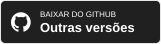

<h1 align="center">Shotera</h1>

<strong>Capture com precisão. Explique com clareza. Mantenha o trabalho em movimento.</strong>

Um aplicativo para Windows de captura de tela, anotação e fixação na área de trabalho, com ferramentas de imagem por IA, OCR offline, seleção inteligente, tradução de imagens e Modo de Apresentação.

<a href="README.md">English</a> · <a href="README.zh-CN.md">简体中文</a> · <a href="README.zh-TW.md">繁體中文</a> · <a href="README.ja.md">日本語</a> · <strong><a href="README.pt-BR.md">Português (Brasil)</a></strong> · <a href="README.es.md">Español</a> · <a href="README.de.md">Deutsch</a> · <a href="README.fr.md">Français</a> · <a href="README.it.md">Italiano</a> · <a href="README.ko.md">한국어</a> · <a href="README.ru.md">Русский</a> · <a href="README.ar.md">العربية</a> · <a href="README.nl.md">Nederlands</a> · <a href="README.pl.md">Polski</a> · <a href="README.sv.md">Svenska</a>

  

 

<h3 align="center">Baixar o Shotera</h3>

 

<strong>🧭 Navegação rápida</strong>

| Conheça o Shotera | Explore | Comece agora |
| --- | --- | --- |
| [Feito para o trabalho depois da captura](#feito-para-o-trabalho-depois-da-captura) [Principais destaques](#principais-destaques) [Galeria do produto](#galeria-do-produto) | [Conjunto completo de recursos](#conjunto-completo-de-recursos) [Fluxo no Windows](#um-fluxo-focado-no-windows) [Privacidade e controle](#privacidade-e-controle) [Idiomas compatíveis](#idiomas-compatíveis) [Palavras-chave](#palavras-chave) | [Download e edições](#download-e-edições) [Suporte e feedback](#suporte-e-feedback) [Apoie o Shotera no Ko-fi](#apoie-o-shotera-no-ko-fi) |

<figure>
<strong>Shotera em resumo.</strong> Captura inteligente, ferramentas de IA, anotações, OCR offline e tradução de imagens em um único aplicativo para Windows.
</figure>

 

## Feito para o trabalho depois da captura

O Shotera transforma uma captura em algo pronto para explicar, compartilhar ou reutilizar. Feedback de produto, relatórios de erros, tutoriais, documentação, suporte, revisões de design e reuniões ficam em um fluxo focado de captura, edição, extração de texto e referência na área de trabalho.

 

## Principais destaques

- **Captura inteligente e precisa:** detecte janelas e elementos aninhados da interface e ajuste a seleção com lupa e controle por pixel.
- **Edição de imagem com IA:** isole objetos com o Recorte por IA e remova conteúdo indesejado com a Borracha por IA.
- **OCR offline e tradução de imagens:** extraia texto copiável no dispositivo e traduza rapidamente textos em imagens, sem enviar capturas para extração de texto.
- **Anotações e proteção de privacidade:** use setas, texto, etapas, ampliação, mosaico e desfoque gaussiano para explicar e ocultar dados sensíveis.
- **Imagens fixadas e Modo de Apresentação:** pressione `F3` para manter referências visíveis ou `Pause` para ocultar distrações da área de trabalho.

 

## Galeria do produto

<figure>
<strong>Captura inteligente.</strong> Pressione <code>F1</code>, escolha uma janela ou elemento e anote diretamente.
</figure>
 
<figure>
<strong>Anotação e ocultação.</strong> Explique etapas e proteja informações com setas, números, mosaico e lupa.
</figure>
 
<figure>
<strong>OCR offline e tradução.</strong> Extraia e traduza texto sem sair do fluxo de captura.
</figure>
 
<figure>
<strong>Recorte por IA.</strong> Separe o objeto do fundo e crie imagens transparentes.
</figure>
 
<figure>
<strong>Adesivos Emoji.</strong> Adicione destaques visuais escaláveis e expressivos.
</figure>
 
<figure>
<strong>Modo de Apresentação.</strong> Pressione <code>Pause</code> para esconder distrações e restaurá-las depois.
</figure>
 
<figure>
<strong>Kit visual completo.</strong> Captura, anotação, OCR, tradução, criação de GIF e Emoji em um só aplicativo.
</figure>

 

## Conjunto completo de recursos

1. **Captura:** use `F1` para regiões, janelas, elementos ou tela inteira, com dimensões, proporção, coordenadas, atraso e predefinições.
2. **Edição por IA:** crie imagens transparentes com Recorte por IA e limpe conteúdo com Borracha por IA.
3. **OCR e tradução:** extraia texto localmente de capturas, imagens e documentos ou traduza texto contido em imagens.
4. **Anotação e ocultação:** adicione formas, setas, texto, desenho, realce, etapas, Emoji e lupa; esconda dados com mosaico ou desfoque.
5. **Fixação na área de trabalho:** use `F3` para fixar capturas e conteúdo compatível da área de transferência e ajustar opacidade, rotação, inversão, clique através e visibilidade.
6. **Modo de Apresentação:** use `Pause` para limpar ícones e distrações e depois restaurar o estado anterior.
7. **Edição e saída:** mova, redimensione, gire, desfaça e refaça; use salvamento rápido e automático, modelos de nome e vários formatos.
8. **Personalização:** configure atalhos, idioma, fontes, inicialização e ícones da bandeja.

 

## Um fluxo focado no Windows

1. Pressione `F1` e escolha uma região, janela, elemento ou a tela inteira.
2. Ajuste os limites com detecção inteligente e lupa.
3. Anote, oculte, extraia, traduza ou aplique ferramentas de IA.
4. Salve, compartilhe ou pressione `F3` para manter o resultado visível.

 

## Privacidade e controle

O Shotera salva as capturas localmente. O OCR offline roda no seu dispositivo, sem exigir o envio da captura para extrair texto. Você também controla atalhos, idioma e fontes, inicialização e ícones da bandeja.

Consulte a [Política de Privacidade](https://shotera.mosuzo.com/privacy).

 

## Idiomas compatíveis

O Shotera está disponível em **15 idiomas de interface**:

<kbd>English</kbd> <kbd>简体中文</kbd> <kbd>繁體中文</kbd> <kbd>日本語</kbd> <kbd>Português (Brasil)</kbd> <kbd>Español</kbd> <kbd>Deutsch</kbd> <kbd>Français</kbd> <kbd>Italiano</kbd> <kbd>한국어</kbd> <kbd>Русский</kbd> <kbd>العربية</kbd> <kbd>Nederlands</kbd> <kbd>Polski</kbd> <kbd>Svenska</kbd>

 

## Palavras-chave

Shotera; Shotera AI; Mosuzo Studio; recorte por IA; reparo de imagem por IA; OCR offline; captura de tela; editor de capturas; anotação de imagem; fixação na área de trabalho; tradução de imagem

 

## Download e edições

 

> **Sobre as edições:** os recursos da edição básica são gratuitos para sempre. Alguns recursos avançados exigem o Pro e podem variar conforme a versão.

 

## Suporte e feedback

Dúvidas, sugestões e comentários são sempre bem-vindos.

   

 

## Apoie o Shotera no Ko-fi

Se o Shotera facilita seu trabalho, seu apoio nos ajuda a continuar desenvolvendo e lançar novos recursos. Também compartilhamos novidades recentes no Ko-fi.

---

 <strong>Mosuzo Studio</strong> · Copyright © 2026. Todos os direitos reservados. O Shotera foi criado para Windows para tornar capturas, comunicação visual e referências na área de trabalho mais eficientes.

