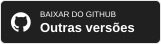

  

<h1 align="center">Shotera</h1>

  <strong>Capture com precisão. Explique com clareza. Mantenha o trabalho em movimento.</strong> 
  Captura · Captura longa · Fixar na área de trabalho · Gravar tela & GIF · OCR offline · Recorte com AI e apagamento com AI

  Um app de captura para Windows: capture rápido, marque rápido, mantenha por perto; 
  copie na hora ou anote na hora.

  
  
  

  
  
  
  

  <a href="README.md">English</a> ·
  <a href="README.zh-CN.md">简体中文</a> ·
  <a href="README.zh-TW.md">繁體中文</a> ·
  <a href="README.ja.md">日本語</a> ·
  <strong><a href="README.pt-BR.md">Português (Brasil)</a></strong> ·
  <a href="README.es.md">Español</a> ·
  <a href="README.de.md">Deutsch</a> ·
  <a href="README.fr.md">Français</a> ·
  <a href="README.it.md">Italiano</a> ·
  <a href="README.ko.md">한국어</a> ·
  <a href="README.ru.md">Русский</a> ·
  <a href="README.ar.md">العربية</a> ·
  <a href="README.nl.md">Nederlands</a> ·
  <a href="README.pl.md">Polski</a> ·
  <a href="README.sv.md">Svenska</a>

 

  <strong>Baixar o Shotera</strong> · Windows 10 / 11 (64 bits)

  
  

<strong>🧭 Navegação rápida</strong>

| O que ele faz | Saiba mais | Comece agora |
| --- | --- | --- |
| [Recursos principais](#recursos-principais): Captura · Captura longa · Fixar na área de trabalho · Gravar tela & GIF · OCR offline · Recorte com AI e apagamento com AI [Mais recursos](#mais-recursos): anotação e ocultação · Adesivos de emoji · Modo apresentação · modo escuro · múltiplos monitores | [Feito para o trabalho depois da captura](#feito-para-o-trabalho-depois-da-captura) [Perguntas frequentes](#perguntas-frequentes) [Fluxo no Windows](#um-fluxo-focado-no-windows) [Privacidade e controle](#privacidade-e-controle) [Idiomas compatíveis](#idiomas-compatíveis) | [Download e edições](#download-e-edições) [Suporte e feedback](#suporte-e-feedback) [Apoie o Shotera no Ko-fi](#apoie-o-shotera-no-ko-fi) |

> **Três passos para começar:** ① instale → ② pressione `F1` e enquadre a região → ③ anote e copie, ou pressione `F3` para fixar na área de trabalho.

<figure>
  
  
<strong>Shotera em resumo.</strong> De capturas e imagens longas a fixar, gravar, extrair texto e finalizar com AI — tudo em uma única janela.

</figure>

 

## Feito para o trabalho depois da captura

A parte difícil raramente é a captura — é tudo o que vem depois: anotar, ocultar, montar uma página longa, extrair texto, manter uma referência à vista. O Shotera reúne esse trabalho em um único fluxo, para que a captura já saia pronta.

- **Sem segunda passada:** anote, oculte e amplie na mesma barra de ferramentas
- **Tudo o que é longo, em uma só imagem:** páginas, conversas e documentos longos, unidos automaticamente
- **Referências sempre à vista:** pressione `F3` para fixar uma captura por cima enquanto você trabalha

Usos comuns: feedback de produto, relatos de bug, tutoriais e documentação, respostas de suporte, revisões de design, demonstrações.

 

## Recursos principais

### 📸 Captura · Uma tecla para capturar, com o enquadramento exato

Pressione `F1`; passe o mouse e o Shotera detecta a janela ou o botão sob o cursor. Depois, ajuste as bordas com a lupa.

- Setas, números de etapa, texto e mosaico, adicionados na hora
- Tamanho fixo, proporção, coordenadas e atraso para capturas repetíveis

**Em detalhes:** encaixe nas bordas de janelas e controles da interface, ajuste pixel a pixel, predefinições salvas e captura com atraso.

<figure>
  
  
<strong>Captura inteligente.</strong> Escolha uma janela ou um controle e anote direto na barra de ferramentas.

</figure>

> **Duas formas de concluir — alterne quando quiser**
>
> **Elegante:** copiado no momento em que você solta a seleção; a notificação no canto inferior direito abre o editor. **Anotação imediata:** a barra de ferramentas aparece junto com a seleção, então você desenha antes de copiar. As duas ficam em Configurações → Captura.

<figure>
  
  
<strong>Duas formas de concluir.</strong> Esquerda: Elegante; direita: Anotação imediata.

</figure>

### 📜 Captura longa · Uma página maior que a tela, em uma só imagem

Páginas, conversas e documentos longos, capturados de ponta a ponta em uma única imagem.

- Rolagem automática ou manual — cada quadro é capturado
- Quadros vizinhos são combinados e mesclados, sem emendas visíveis
- Prévia da montagem ao vivo: pare quando a imagem estiver completa

**Em detalhes:** ideal para páginas web longas, conversas de chat e documentos inteiros; o resultado vai direto para documentação e issues.

<figure>
  
  
<strong>Captura longa.</strong> Páginas e conversas longas, unidas em uma única imagem.

</figure>

### 📌 Fixar na área de trabalho · Fixe referências por cima e trabalhe ao lado delas

Pressione `F3` para manter uma captura por cima de tudo — compare e consulte sem trocar de janela.

- Escala, rotação, transparência e clique através
- Clique duplo alterna entre tamanho original e miniatura; restaure a última imagem fixada com um clique

**Em detalhes:** arraste qualquer borda ou canto para redimensionar com a proporção travada; as imagens fixadas ficam acima das suas janelas e nunca bloqueiam cliques.

<figure>
  
  
<strong>Fixar na área de trabalho.</strong> Mantenha referências por cima enquanto trabalha.

</figure>

### 🎬 Gravar tela & GIF · Grave em 4K, pelo tempo que for preciso

Transforme o “difícil de explicar” em um vídeo que qualquer pessoa acompanha.

- 720p / 1080p / 2K / 4K a 30 ou 60 fps, sem limite de duração da gravação
- Cursor e cliques em destaque; exporte em MP4 ou GIF leve

**Em detalhes:** os GIFs ficam leves o bastante para documentação, issues e conversas, e os modos de alta resolução acompanham telas HiDPI.

<figure>
  
  
<strong>Gravar tela & GIF.</strong> Mostre uma vez, em vez de explicar duas.

</figure>

### 🔍 OCR offline e tradução de imagens · Transforme pixels de volta em texto

- **OCR offline:** vários idiomas, texto pronto para copiar e colar em um clique
- **Tradução de imagens:** leia capturas de outros idiomas no seu idioma
- **Leitura de QR Code e código de barras:** links, Wi-Fi, contatos e códigos de produto

**Em detalhes:** o reconhecimento roda no seu dispositivo e o resultado está a um clique da área de transferência.

<figure>
  
  
<strong>OCR offline e tradução de imagens.</strong> Extraia e traduza sem sair do fluxo de captura.

</figure>

### ✨ Recorte com AI e apagamento com AI · AI que finaliza a captura para você

- **Recorte com AI:** pessoas, produtos e logotipos — um PNG transparente em segundos
- **Apagamento com AI:** remova o que não deveria estar ali e marcas d'água; a AI reconstrói o que estava atrás

**Em detalhes:** os dois rodam em modelos locais — a imagem original nunca é enviada. Os recortes podem ser copiados ou salvos como PNG transparente.

<figure>
  
  
<strong>Recorte com AI.</strong> Objeto e fundo, separados em um passo.

</figure>

 

## Mais recursos

### 🖊️ Anotação e ocultação

Setas, texto, caneta, marca-texto, numeração, lupa; mosaico e desfoque gaussiano para o que for privado.

**Em detalhes:** as anotações podem ser movidas, redimensionadas e giradas, com desfazer e refazer sempre que você mudar de ideia.

<figure>
  
  
<strong>Anotação e ocultação.</strong> Explique os passos com clareza e proteja o que é sensível.

</figure>

### 😀 Adesivos de emoji

Centenas de adesivos, para redimensionar e posicionar onde quiser — um pouco de diversão e muito mais destaque.

<figure>
  
  
<strong>Adesivos de emoji.</strong> Direcione o olhar exatamente para o que importa.

</figure>

### 🖥️ Modo apresentação

Pressione `Pause` para limpar a desordem antes de uma demonstração ou gravação; tudo volta ao lugar depois.

<figure>
  
  
<strong>Modo apresentação.</strong> Pressione uma vez para organizar a área de trabalho; de novo para desfazer.

</figure>

### 🧰 Pequenos detalhes

- **Visualizador e editor de imagens:** abra as capturas em uma janela própria — navegue pela pasta, amplie e faça retoques
- **Múltiplos monitores e HiDPI:** um só espaço de coordenadas entre as telas; nítido em telas de alto DPI
- **Modo escuro:** siga o sistema ou escolha o seu
- **Exportação e personalização:** salvamento rápido, salvamento automático e modelos de nome de arquivo; atalhos, idioma, fontes e inicialização personalizáveis

 

## Perguntas frequentes

**Preciso de conexão com a internet?**
Capturas e edições acontecem na sua máquina; o OCR offline, o recorte com AI e o apagamento com AI também rodam no seu dispositivo.

**Quais atalhos ele usa?**
`F1` captura · `F3` fixar · `Pause` modo apresentação.

**Como capturo uma página longa?**
Mude para a Captura longa e role a página — os quadros são unidos automaticamente em uma única imagem.

Mais perguntas são respondidas nas [perguntas frequentes do site](https://shotera.mosuzo.com/pt-br/faq).

 

## Um fluxo focado no Windows

1. Anote na hora (Anotação imediata) ou copie primeiro e edite depois (Elegante).
2. Conteúdo longo vai para a Captura longa; precisa de uma demonstração? Grave um clipe com Gravar tela & GIF.
3. Salve, copie ou compartilhe; pressione `F3` quando quiser a captura ao seu lado.

 

## Privacidade e controle

As capturas são armazenadas localmente; o OCR offline, o recorte com AI e o apagamento com AI rodam no seu dispositivo, então esse processamento não envia suas capturas. Leia a [política de privacidade](https://shotera.mosuzo.com/pt-br/privacy) para saber os detalhes.

 

## Idiomas compatíveis

O Shotera está disponível em **15 idiomas de interface**:

  <kbd>Inglês</kbd>
  <kbd>Chinês simplificado</kbd>
  <kbd>Chinês tradicional</kbd>
  <kbd>Japonês</kbd>
  <kbd>Português (Brasil)</kbd>
  <kbd>Espanhol</kbd>
  <kbd>Alemão</kbd>
  <kbd>Francês</kbd>
  <kbd>Italiano</kbd>
  <kbd>Coreano</kbd>
  <kbd>Russo</kbd>
  <kbd>Árabe</kbd>
  <kbd>Holandês</kbd>
  <kbd>Polonês</kbd>
  <kbd>Sueco</kbd>

 

## Palavras-chave

Shotera; Shotera AI; Mosuzo Studio; ferramenta de captura de tela; captura com rolagem; captura longa; anotação de captura de tela; fixar na área de trabalho; gravação de tela; gravação de GIF; recorte com AI; apagamento com AI; OCR offline; tradução de imagens

 

## Download e edições

  
  

> **Requisitos:** Windows 10 / 11 (64 bits).
>
> **Edições:** Standard e Lite — veja a [comparação de edições](https://shotera.mosuzo.com/pt-br/versions).

 

## Suporte e feedback

Dúvidas, sugestões e comentários são sempre bem-vindos.

  
  
  
  

 

## Apoie o Shotera no Ko-fi

Se o Shotera facilita seu trabalho, seu apoio nos ajuda a continuar desenvolvendo e lançar novos recursos. Também compartilhamos novidades recentes no Ko-fi.

  

---

  
  <strong>Mosuzo Studio</strong> · © 2026 Todos os direitos reservados 
  O Shotera foi criado para Windows para tornar capturas, comunicação visual e referências na área de trabalho mais eficientes.

  <a href="https://shotera.mosuzo.com">Site oficial</a> ·
  <a href="https://shotera.mosuzo.com/pt-br/versions">Versões</a> ·
  <a href="https://shotera.mosuzo.com/pt-br/changelog">Novidades</a> ·
  <a href="https://shotera.mosuzo.com/pt-br/faq">Perguntas frequentes</a> ·
  <a href="https://shotera.mosuzo.com/pt-br/privacy">Privacidade</a> ·
  <a href="https://github.com/mosuzo-studio/Shotera/issues">Feedback</a>

