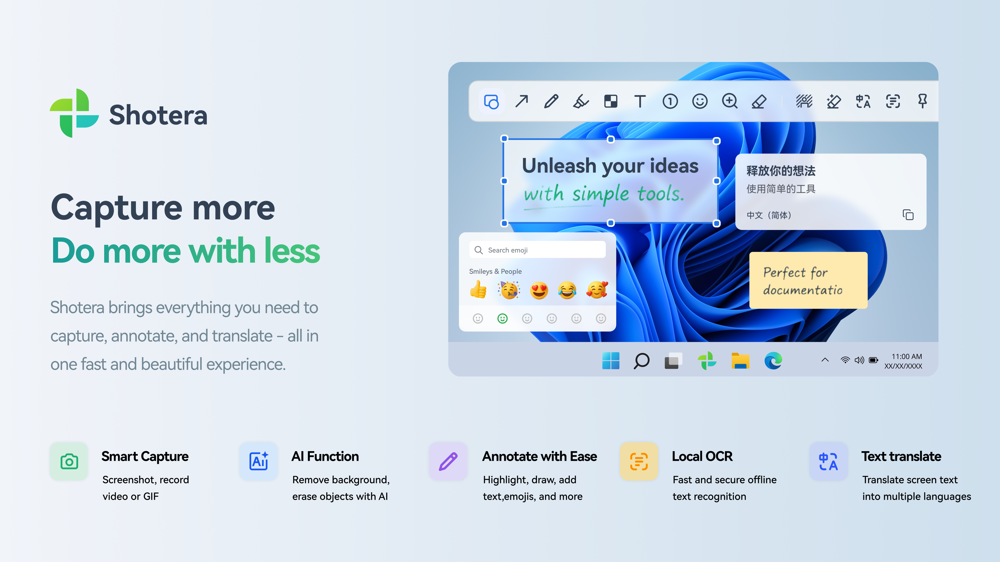
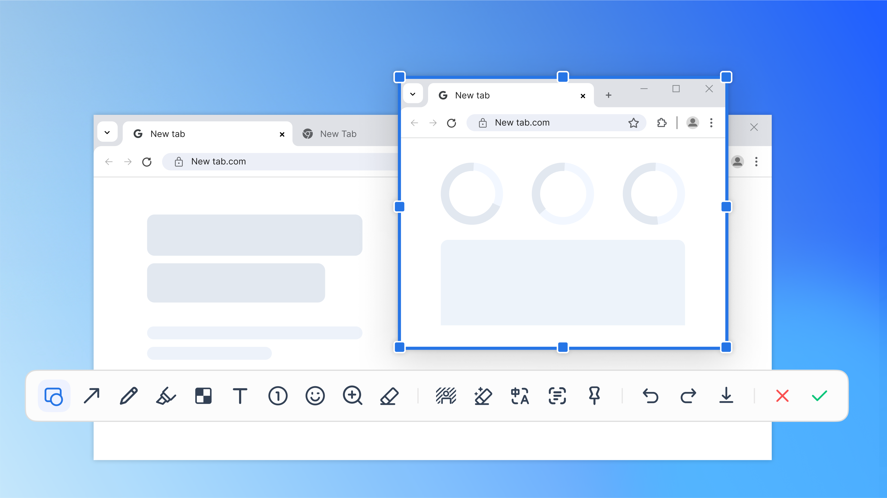
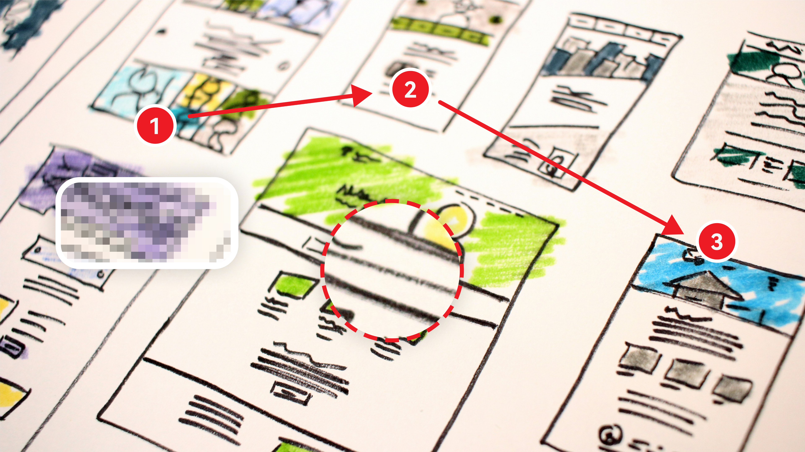
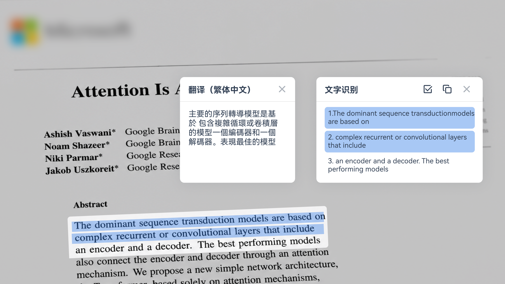
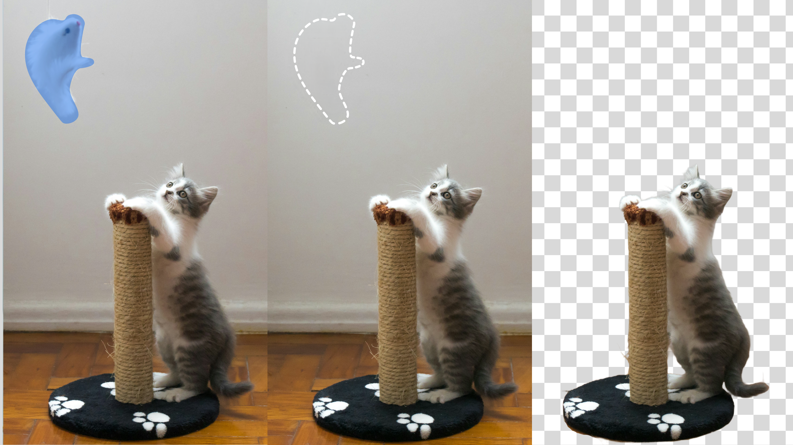
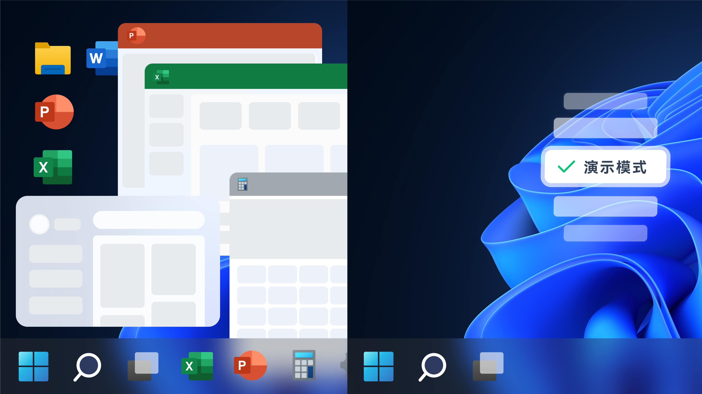
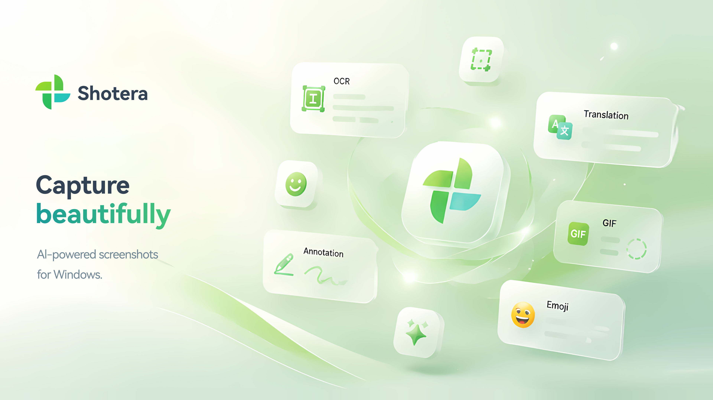
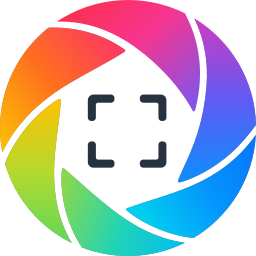

  

<h1 align="center">Shotera</h1>

  <strong>精准截图，清晰表达，让工作持续向前。</strong>

  一款面向 Windows 的截图、标注与桌面贴图工具，集成 AI 图像处理、本地 OCR、智能选区、图片翻译和演示模式。

  <a href="README.md">English</a> ·
  <strong><a href="README.zh-CN.md">简体中文</a></strong> ·
  <a href="README.zh-TW.md">繁體中文</a> ·
  <a href="README.ja.md">日本語</a> ·
  <a href="README.pt-BR.md">Português (Brasil)</a> ·
  <a href="README.es.md">Español</a> ·
  <a href="README.de.md">Deutsch</a> ·
  <a href="README.fr.md">Français</a> ·
  <a href="README.it.md">Italiano</a> ·
  <a href="README.ko.md">한국어</a> ·
  <a href="README.ru.md">Русский</a> ·
  <a href="README.ar.md">العربية</a> ·
  <a href="README.nl.md">Nederlands</a> ·
  <a href="README.pl.md">Polski</a> ·
  <a href="README.sv.md">Svenska</a>

  
  
  

 

<h3 align="center">下载 Shotera</h3>

  
  

<strong>🧭 快速导航</strong>

| 了解 Shotera | 深入了解 | 开始使用 |
| --- | --- | --- |
| [为截图之后的工作而生](#为截图之后的工作而生) [核心亮点](#核心亮点) [产品图集](#产品图集) | [完整功能](#完整功能) [Windows 工作流](#专注的-windows-工作流) [隐私与掌控感](#隐私与掌控感) [支持语言](#支持语言) [关键词](#关键词) | [下载与版本](#下载与版本) [支持与反馈](#支持与反馈) [在 Ko-fi 上支持 Shotera](#在-ko-fi-上支持-shotera) |

<figure>
  
  
<strong>Shotera 一览。</strong> 在一款 Windows 应用中完成智能截图、AI 图像处理、标注、本地 OCR 与图片翻译。

</figure>

 

## 为截图之后的工作而生

Shotera 让截图从“捕获”直接走向“可用”。无论是产品反馈、缺陷报告、教程、文档、客服支持、设计评审还是会议演示，都可以在一个专注的工作流中完成截图、编辑、文字提取与桌面参考，更快地把重点说明清楚。

 

## 核心亮点

- **智能精准截图：** 自动识别窗口与嵌套控件，配合截图放大镜和像素级调整，快速锁定目标区域。
- **AI 图像处理：** 使用 AI 抠图快速分离主体，通过 AI 擦图移除画面中不需要的内容。
- **本地 OCR 与图片翻译：** 在设备端提取可复制文字，并快速翻译图片中的文本，无需上传截图。
- **专业标注与隐私保护：** 使用箭头、文字、自动序号、局部放大、马赛克和高斯模糊，让说明更清楚、信息更安全。
- **桌面贴图与演示模式：** 按 `F3` 将内容置顶参考；按 `Pause` 可在会议或演示前快速隐藏桌面干扰项。

 

## 产品图集

<figure>
  
  
<strong>智能截图。</strong> 按 <code>F1</code> 开始截图，选择窗口或界面控件后，直接在截图工具栏中完成标注。

</figure>

 

<figure>
  
  
<strong>标注与脱敏。</strong> 用箭头、序号、马赛克和局部放大镜清晰说明操作，并保护敏感内容。

</figure>

 

<figure>
  
  
<strong>本地 OCR 与图片翻译。</strong> 无需离开截图流程，即可提取可复制文字并翻译图片内容。

</figure>

 

<figure>
  
  
<strong>AI 抠图。</strong> 一步分离图片主体与背景，便于制作透明背景素材。

</figure>

 

<figure>
  
  
<strong>Emoji 表情贴纸。</strong> 使用可缩放的视觉贴纸突出重点，让截图更易理解。

</figure>

 

<figure>
  
  
<strong>演示模式。</strong> 按 <code>Pause</code> 在会议或演示前隐藏桌面干扰项，结束后恢复原有状态。

</figure>

 

<figure>
  
  
<strong>完整的视觉工具集。</strong> 截图、标注、OCR、翻译、GIF 制作和 Emoji 支持在同一款应用中协同工作。

</figure>

 

## 完整功能

1. **截图：** 按 `F1` 截取区域、窗口、界面控件或全屏，并可设置固定尺寸、比例、屏幕坐标、延时和常用预设。
2. **AI 图像处理：** 使用 AI 抠图制作透明背景素材，通过 AI 擦图清理画面中不需要的内容。
3. **OCR 与翻译：** 在本机提取截图、图片和文档中的可复制文字，或翻译图片中的文本。
4. **标注与脱敏：** 添加图形、箭头、文字、画笔、荧光笔、自动序号、Emoji 贴纸和局部放大，并使用马赛克或高斯模糊遮挡敏感内容。
5. **桌面贴图：** 按 `F3` 置顶截图或剪贴板中的兼容图片、文字和颜色，并调整透明度、旋转、翻转、鼠标穿透、显示状态及最近关闭内容。
6. **演示模式：** 按 `Pause` 清理会议或演示时的桌面图标与干扰项，并在结束后恢复原有状态。
7. **编辑与输出：** 移动、缩放、旋转和调整标注样式，支持撤销与重做，并通过快捷保存、自动保存、文件名模板和多种图像格式输出成果。
8. **个性化设置：** 自定义快捷键、界面语言、字体、启动方式和托盘图标。

 

## 专注的 Windows 工作流

1. 按 `F1`，选择自由区域、窗口、界面控件或全屏。
2. 使用智能控件识别和截图放大镜，细调选区边界。
3. 根据需要完成标注、脱敏、文字提取、翻译或 AI 图像处理。
4. 保存或分享结果；也可按 `F3` 将内容留在桌面上，边看边做。

 

## 隐私与掌控感

Shotera 将截图保存在本地。本地离线 OCR 直接在设备上运行，提取文字时无需上传截图。

你还可以自定义快捷键、界面语言与字体、启动方式和托盘图标，始终掌控自己的使用方式。

详情请阅读[隐私政策](https://shotera.mosuzo.com/zh/privacy)。

 

## 支持语言

Shotera 支持 **15 种界面语言**：

  <kbd>英语</kbd>
  <kbd>简体中文</kbd>
  <kbd>繁体中文</kbd>
  <kbd>日语</kbd>
  <kbd>巴西葡萄牙语</kbd>
  <kbd>西班牙语</kbd>
  <kbd>德语</kbd>
  <kbd>法语</kbd>
  <kbd>意大利语</kbd>
  <kbd>韩语</kbd>
  <kbd>俄语</kbd>
  <kbd>阿拉伯语</kbd>
  <kbd>荷兰语</kbd>
  <kbd>波兰语</kbd>
  <kbd>瑞典语</kbd>

 

## 关键词

Shotera；Shotera AI；Mosuzo Studio；AI 抠图；AI 修复；离线 OCR；截图工具；截图编辑；截图标注；桌面贴图；图片翻译

 

## 下载与版本

  
  

> **版本说明：** 基础版本的功能永久免费使用，部分高级功能需升级 Pro，具体以实际发布版本为准。

 

## 支持与反馈

欢迎提出问题与建议，也欢迎分享你的使用体验。

  
  
  
  

 

## 在 Ko-fi 上支持 Shotera

如果 Shotera 让你的工作更轻松，你的支持将帮助我们持续开发、带来更多新功能。我们也会在 Ko-fi 分享产品开发中的新进展与近期动态。

  

---

  
  <strong>Mosuzo Studio</strong> · © 2026 保留所有权利 
  Shotera 专为 Windows 打造，让截图、视觉表达与桌面参考更加高效。

